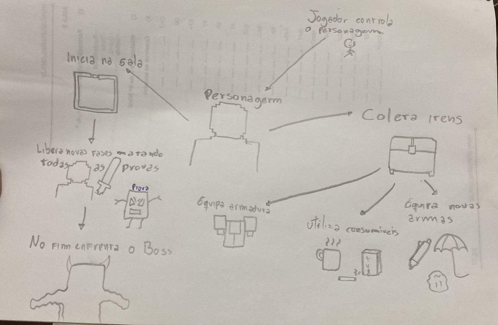

# Projeto MadDev 

**Código da Disciplina**: FGA0208<br>
**Número do Grupo**: 01<br>
**Entrega**: 01<br>

## Alunos

| Matrícula | Aluno                                                           |
| --------- | --------------------------------------------------------------- |
| 202017343 | [Breno Lucena Cordeiro](https://github.com/BrenoLUCO)           |
| 211061716 | [Felipe Santos Veríssimo](https://github.com/verissimoo)        |
| 221022631 | [Kauã Richard de Souza Cavalcante](https://github.com/rich4rd1) |
| 190112093 | [Lucas Freire Lopes](https://github.com/AguionStryke)           |
| 202016963 | [Mateus Vinicius Vieira](https://github.com/matix0)             |
| 211062830 | [Philipe Barbosa de Morais](https://github.com/PhMoraiis)       |
| 232014754 | [Pietro Calegari Visentin](https://github.com/Pietrocv)         |
| 200062891 | [Vinicius Fernandes Rufino](https://github.com/RufinoVfR)       |


## Sobre 
Repositório destinado a documentar as entregas do Projeto MadDev, que consiste no desenvolvimento de um jogo estilo dungeon crawler, onde o jogador controla um personagem que deve explorar um labirinto gerado proceduralmente, enfrentando inimigos e coletando itens para progredir. O projeto utiliza a linguagem de progamação GDscript, e é desenvolvido utilizando a engine de jogos Godot.
Contextualize, usando referências, links, e outros materiais como fontes.

## Screenshots da Primeira Entrega



**Rich Picture** - Representação visual da ideia central do projeto. Desenvolvido por [Felipe Santos Veríssimo](https://github.com/verissimoo).


**Protótipo de Baixa Fidelidade** - Esboços em papel da interface e fluxos do jogo. Desenvolvido por [Mateus Vinicius Vieira](https://github.com/matix0).

## Há algo a ser executado?

(x) SIM

( ) NÃO

Se SIM, insira um manual (ou um script) para auxiliar ainda mais os interessados na execução.


### Tecnologia

A geração do site estático é realizada utilizando o [docsify](https://docsify.js.org/).

```shell
"Docsify generates your documentation website on the fly. Unlike GitBook, it does not generate static html files. Instead, it smartly loads and parses your Markdown files and displays them as a website. To start using it, all you need to do is create an index.html and deploy it on GitHub Pages."
```

#### Instalando o docsify

Execute o comando:

```shell
npm i docsify-cli -g
```

#### Executando localmente

Para iniciar o site localmente, utilize o comando:

```shell
docsify serve ./docs
```
## Histórico de Versionamento

| Nome                                        | Alteração                | Versão | Data       |
| ------------------------------------------- | ------------------------ | ------ | ---------- |
| [Mateus Vieira](https://github.com/matix0/) | Setup inicial do projeto | v0.1   | 13/04/2026 |