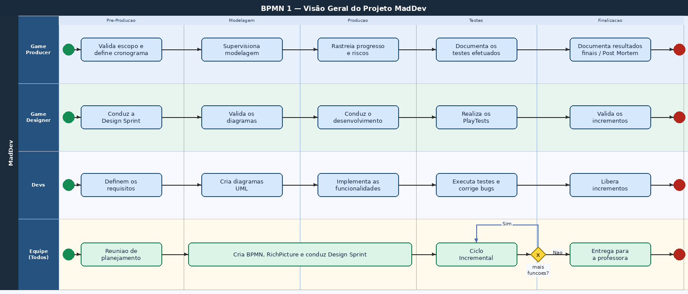
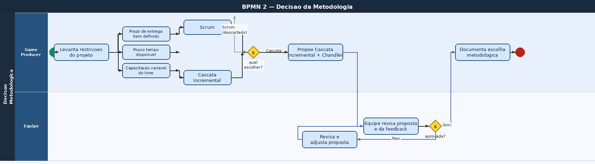
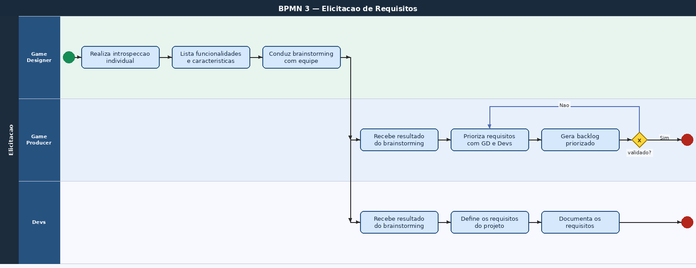
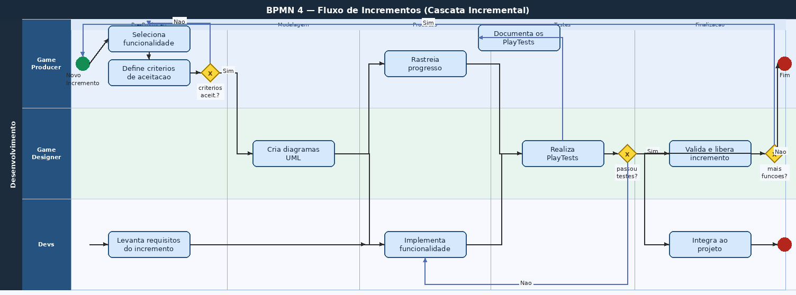

# 1.3. Módulo Modelagem BPMN

## O que é a Modelagem BPMN?
Trata-se de uma notação muito reconhecida na comunidade científica bem como no mercado, a qual é comumente utilizada para especificação de processos de desenvolvimento.
Essa notação, como perceberão com as vídeo-aulas, é muito rica e permite especificar atividades de vários tipos, retroalimentação (loops), temporalidade, participantes, dentre outros aspectos inerentes à documentação de um processo de desenvolvimento de software. 

## Visão Geral do Projeto - MadDev

*Desenvolvido por: [Breno Lucena Cordeiro](https://github.com/BrenoLUCO), [Mateus Vinicius Vieira](https://github.com/matix0) & [Vinicius Fernandes Rufino](https://github.com/RufinoVfR)*

## Decisão da Metodologia

*Desenvolvido por: [Philipe Barbosa de Morais](https://github.com/PhMoraiis), [Kauã Richard de Souza Cavalcante](https://github.com/rich4rd1), [Mateus Vinicius Vieira](https://github.com/matix0) & [Vinicius Fernandes Rufino](https://github.com/RufinoVfR)*

## Elicitação de Requisitos

*Desenvolvido por: [Pietro Calegari Visentin](https://github.com/Pietrocv), [Lucas Freire Lopes](https://github.com/AguionStryke), [Mateus Vinicius Vieira](https://github.com/matix0) & [Vinicius Fernandes Rufino](https://github.com/RufinoVfR)*

## Incrementos

*Desenvolvido por: [Felipe Santos Veríssimo](https://github.com/verissimoo), [Mateus Vinicius Vieira](https://github.com/matix0) & [Vinicius Fernandes Rufino](https://github.com/RufinoVfR)*

## Referências
- Material de Apoio do Aprender3

## Histórico de Versionamento

| Nome                                                                                             | Alteração                                        | Versão | Data       |
| ------------------------------------------------------------------------------------------------ | ------------------------------------------------ | ------ | ---------- |
| [Mateus Vieira](https://github.com/matix0/)                                                      | Setup inicial do projeto                         | v0.1   | 30/03/2026 |
| [Breno Lucena Cordeiro](https://github.com/BrenoLUCO)                                            | BPMN - Visão Geral do Projeto                    | v0.2   | 04/04/2026 |
| [Philipe Barbosa](https://github.com/PhMoraiis) & [Kauã Richard](https://github.com/rich4rd1)    | BPMN - Decisão da Metodologia                    | v0.3   | 04/04/2026 |
| [Pietro Visentin](https://github.com/Pietrocv) & [Lucas Freire](https://github.com/AguionStryke) | BPMN - Elicitação de Requisitos                  | v0.4   | 04/04/2026 |
| [Felipe Veríssimo](https://github.com/verissimoo)                                                | BPMN - Incrementos                               | v0.5   | 04/04/2026 |
| [Mateus Vieira](https://github.com/matix0/) & [Vinicius Rufino](https://github.com/RufinoVfR)    | Participação na modelagem de todas as atividades | v1.0   | 04/04/2026 |