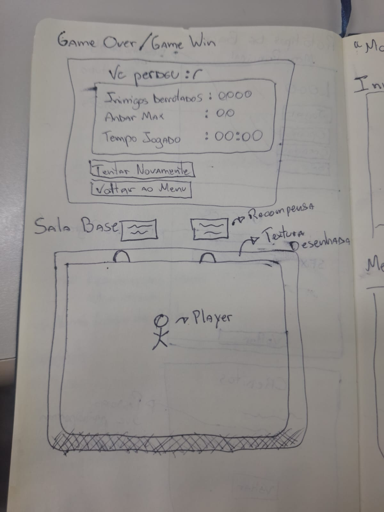
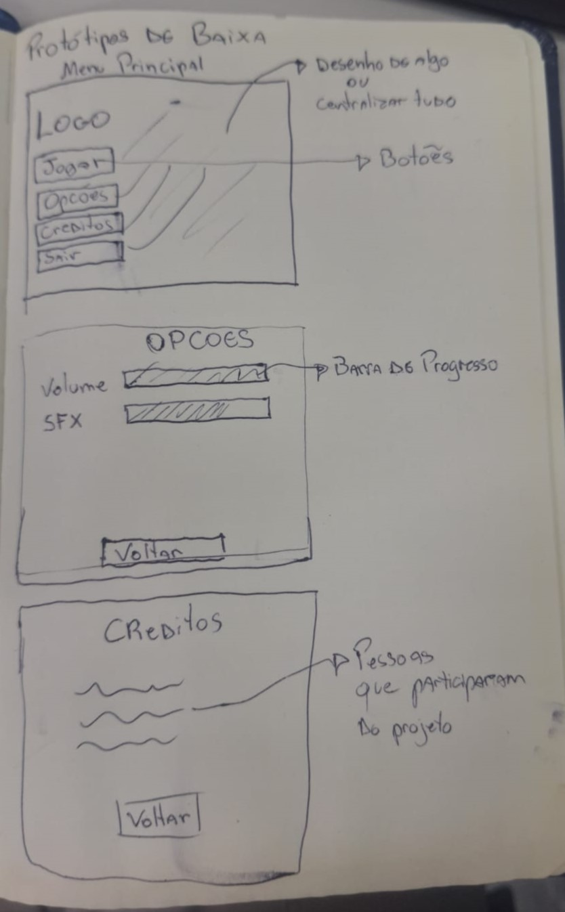
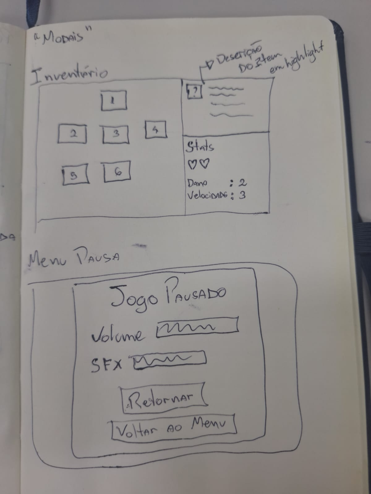

# 1.2.6. Protótipos

## O que são Protótipos?
Protótipos são representações visuais ou interativas de um produto ou sistema, criados para explorar ideias, validar conceitos e comunicar a visão do projeto. Eles podem variar desde esboços simples em papel até modelos digitais mais elaborados, e são usados para obter feedback precoce de stakeholders, identificar problemas de usabilidade e refinar requisitos antes do desenvolvimento completo.
Esses protótipos podem ser classificados em diferentes tipos, como protótipos de baixa fidelidade (wireframes, mockups), média fidelidade (modelos parciais que demonstram funcionalidades) e protótipos de alta fidelidade (modelos interativos que se assemelham ao produto final). A escolha do tipo de protótipo depende dos objetivos do projeto, do estágio de desenvolvimento e dos recursos disponíveis.
Dado o contexto do desenvolvimento de um jogo, os protótipos podem incluir esboços de personagens, layouts de níveis, mecânicas de jogo e interfaces de usuário, permitindo que a equipe visualize e teste aspectos cruciais do design antes de investir tempo e recursos na implementação completa.
Optamos por fazer protótipos de baixa e média fidelidade, utilizando ferramentas como papel, caneta e softwares de design gráfico, visto que não temos uma equipe artistica para criar os assets visuais necessários para um protótipo de alta fidelidade. Esses protótipos nos permitem explorar e comunicar nossas ideias de forma eficaz, sem a necessidade de recursos avançados, e são adequados para o estágio inicial do desenvolvimento do jogo.

## Protótipos do Produto
### Protótipo de Baixa Fidelidade
#### Tela de fim de jogo + Tela Base do jogo

#### Telas do Menu Principal

#### Inventário e Menu de Pausa

### Protótipo de Média Fidelidade

<iframe style="border: 1px solid rgba(0, 0, 0, 0.1);" width="800" height="450" src="https://embed.figma.com/design/nR0yB4PAk9mejjeFeNT7BX/Untitled?node-id=0-1&embed-host=share" allowfullscreen></iframe>

## Referências
- Material disponibilizado via Aprender3

## Histórico de Versionamento

| Nome                                           | Alteração                                  | Versão | Data       |
| ---------------------------------------------- | ------------------------------------------ | ------ | ---------- |
| [Pietro Visentin](https://github.com/Pietrocv) | Confecção do Protótipo de Média Fidelidade | v0.2   | 03/04/2026 |
| [Mateus Vieira](https://github.com/matix0/)    | Confecção do Protótipo de Baixa Fidelidade | v0.1   | 31/03/2026 |