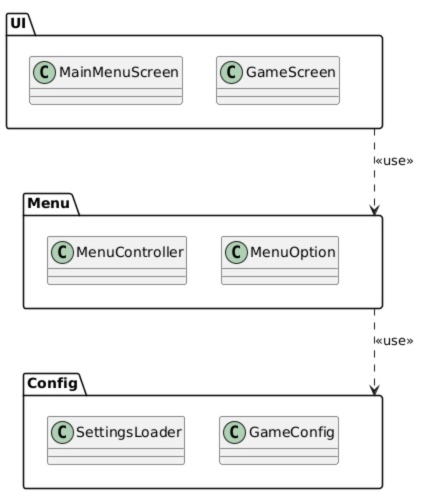

# 2.1.1. Diagramas de Pacotes

## O que é um Diagrama de Pacotes?

Um Diagrama de Pacotes é uma representação estrutural da UML utilizada na engenharia de software para organizar o sistema em módulos maiores, agrupando elementos relacionados por responsabilidade. Seu objetivo principal é apresentar, em alto nível, a arquitetura do sistema, evidenciando a separação entre partes do domínio e as dependências existentes entre elas.

## Justificativa

Os Diagramas de Pacotes foram adotados com a justificativa de fornecer uma visão arquitetural macro do sistema, agrupando classes e componentes que compartilham responsabilidades afins em módulos lógicos. Esta modularização (como a separação entre UI, Menu e Config) é fundamental para gerenciar as dependências entre diferentes subsistemas, organizando o código-fonte, evitando acoplamento excessivo e facilitando a divisão do trabalho durante a etapa de desenvolvimento.

## Diagramas de Pacotes Desenvolvidos

### Iniciar partida e navegar no menu principal

  

*Desenvolvido por: [Breno Lucena](https://github.com/BrenoLUCO)*

#### Descrição do Modelo

O diagrama organiza os elementos em três pacotes principais:

- **UI**
  - `MainMenuScreen`
  - `GameScreen`
- **Menu**
  - `MenuController`
  - `MenuOption`
- **Config**
  - `SettingsLoader`
  - `GameConfig`

#### Relações entre Pacotes

- O pacote **UI** utiliza elementos do pacote **Menu**.
- O pacote **Menu** utiliza elementos do pacote **Config**.
- As dependências `<<use>>` indicam direção de uso entre camadas.

### Sistema de Equipamentos

*Desenvolvido por: [Pietro Calegari Visentin](https://github.com/pietrocv)*

## Histórico de Versionamento

| Nome                                                     | Alteração                                                                   | Versão | Data       | Revisor                                     | Data de Revisão | Revisão                                                                                                                                                |
| -------------------------------------------------------- | --------------------------------------------------------------------------- | ------ | ---------- | ------------------------------------------- | --------------- | ------------------------------------------------------------------------------------------------------------------------------------------------------ |
| [Mateus Vieira](https://github.com/matix0/)              | Setup inicial do projeto                                                    | v0.1   | 13/04/2026 |                                             |                 |                                                                                                                                                        |
| [Philipe Morais](https://github.com/PhMoraiis/)          | Adiciona Diagrama de Componentes para Consumiveis                           | v1.1   | 22/04/2026 | [Mateus Vieira](https://github.com/matix0/) | 22/04/2026      | Diagrama bem estrutrado e explica bem como o sistema deve se comportar na situação                                                                     |
| [Pietro Calegari Visentin](https://github.com/pietrocv)  | Adição do Diagrama de Pacotes do Sistema de Equipamentos                    | v1.2   | 22/04/2026 | [Mateus Vieira](https://github.com/matix0/) | 22/04/2026      | Descreve bem o funcionamento do sistema de equipamentos abrangendo tanto equipamentos itens e o status do jogador                                      |
| [Lucas Freire](https://github.com/AguionStryke)          | Adição do Diagrama de Classes Vida, Cura e Morte do Personagem              | v1.3   | 23/04/2026 | [Mateus Vieira](https://github.com/matix0/) | 23/04/2026      | Representação muito clara das classes que devem ser utilizadas para que o sistema de vida e dano do personagem, faltou o método de morte para o player |
| [Vinícius Rufino](https://github.com/RufinoVfR)          | Adiciona Diagrama de Componentes para Inventário                            | v1.4   | 23/04/2026 | [Mateus Vieira](https://github.com/matix0/) | 23/04/2026      | Representa bem como as camadas de controle funcionam entre si e a persistencia dos itens do inventário                                                 |
| [Lucas Freire](https://github.com/AguionStryke)          | Adição da descrição do Diagrama de Classes Vida, Cura e Morte do Personagem | v1.5   | 22/04/2026 | [Mateus Vieira](https://github.com/matix0/) | 23/04/2026      | Descrição Foi adicionado o método que faltava                                                                                                          |  |
| [Kauã Richard](https://github.com/kauarichard)           | Adiciona Diagrama de Classes para Combate                                   | v1.6   | 23/04/2026 | [Mateus Vieira](https://github.com/matix0/) | 22/04/2026      | Fluxo bem estruturado do sistema de combate, senti falta dos métodos de morte do inimigo e jogador, também o método de receber dano do jogador         |
| [Felipe Santos Veríssimo](https://github.com/verissimoo) | Adição do Diagrama de Componentes Pausar/Retomar (US-49, US-50)             | v1.7   | 24/04/2026 | [Mateus Vieira](https://github.com/matix0/) | 23/04/2026      | Representação muito boa do fluxo de componentes utilizados no sistema de pausa                                                                         |
| [Breno Lucena](https://github.com/BrenoLUCO/)            | Adição do diagrama estático (pacotes) e descrição completa                  | v1.8   | 23/04/2026 | [Mateus Vieira](https://github.com/matix0/) | 23/04/2026      | Diagrama simples e efetivo representando o fluxo de inicio de jogo                                                                                     |