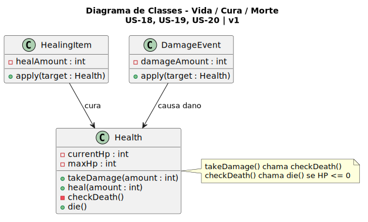
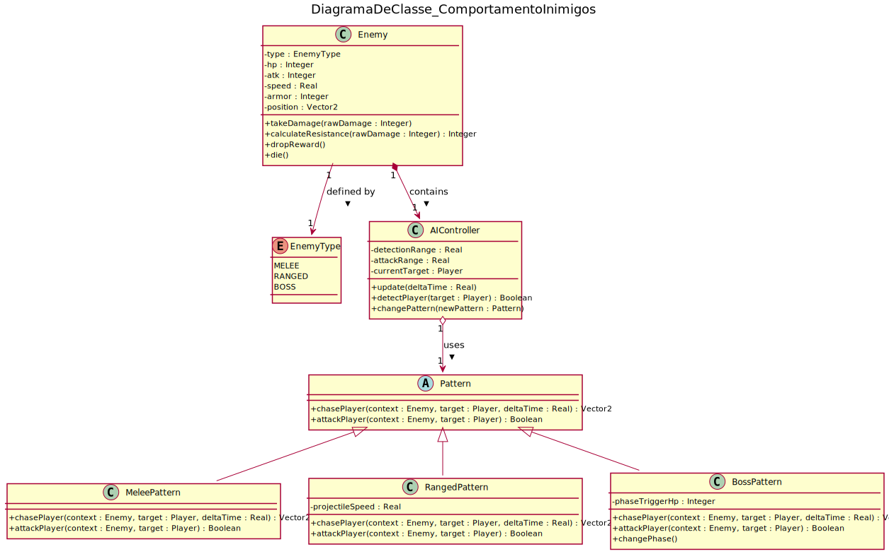
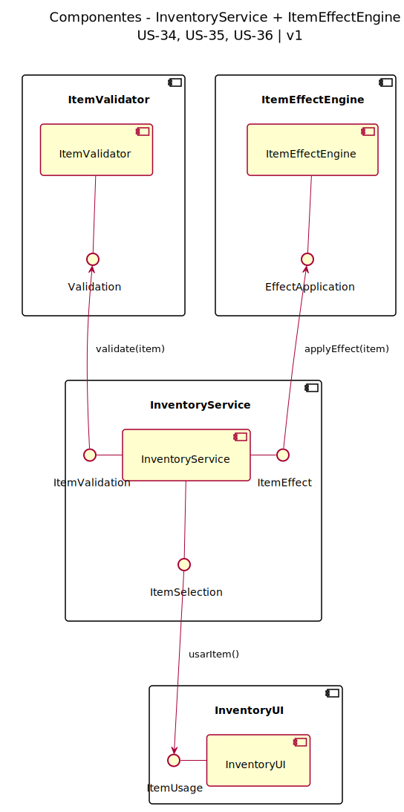
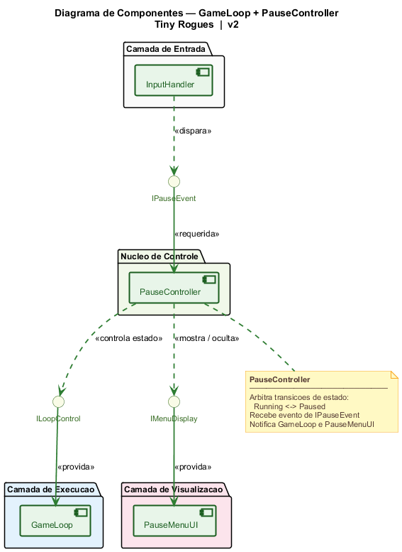
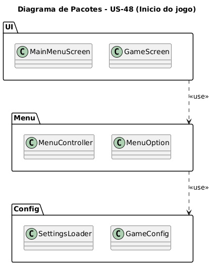
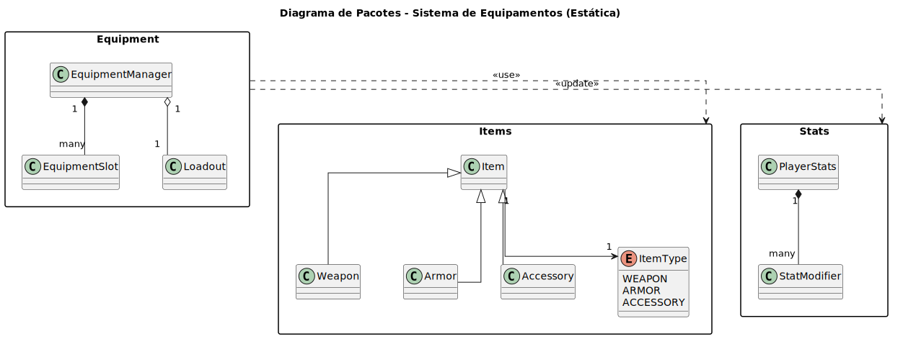

# 2.1. Módulo Notação UML – Modelagem Estática

## O que é um Diagrama de Classes?

Um Diagrama de Classes é uma representação visual da UML utilizada na engenharia de software para mostrar a estrutura estática do sistema, incluindo suas classes, atributos, métodos e relacionamentos. Seu objetivo principal é representar, em alto nível, a arquitetura do sistema, destacando quais componentes são necessários e como eles se comunicam entre si.

Foi desenvolvido um Diagrama de Classes para representar o comportamento dos inimigos durante os combates no jogo, onde foram identificadas as classes principais envolvidas nesse comportamento, seus atributos e métodos, e os relacionamentos entre elas a fim de guiar o desenvolvimento do sistema e garantir que as funcionalidades relacionadas ao comportamento dos inimigos sejam implementadas de forma consistente e eficiente.

Também foi desenvolvido um diagrama de classes para representar o comportamento da barra de vida do jogador durante o jogo, identificando suas classes principais, e seus atributos e relacionamentos. Essa modelagem ilustra as alterações possiveis da vida do jogador, incluindo a condição para a morte do jogador, a fim de guiar a implementação do sistema de vida e as funcionalidades relacionadas.

### Diagramas de Classes Desenvolvidos

| Diagrama de Classes                   | Descrição                                                           | Responsável  | Status     |
| ------------------------------------- | ------------------------------------------------------------------- | ------------ | ---------- |
| Comportamento dos Inimigos em Combate | Representa o comportamento dos inimigos durante os combates no jogo | Mateus       | Em Revisão |
| Vida, Cura e Morte do Personagem      | Representa o comportamento da barra de vida durante o jogo.         | Lucas Freire | Em Revisão |

---

#### 2.1.1 — Sistema de Combate e Projéteis

Modelagem da estrutura de classes para o sistema de combate, cobrindo as mecânicas de armas e projéteis (US-21, US-22).

##### Descrição

O diagrama de classes descreve a estrutura estática das entidades envolvidas no combate e como elas se relacionam para permitir ataques físicos e à distância.

##### Atributos e Métodos Principais

###### Player / Enemy

- **Atributos**: vida (int), posição (Vecor2), estaVivo(boolean).
- **Métodos**: sofreDano(valor), executaAtaque(), verificaMorte().
- **Relação**: Possuem uma **Hitbox** (Composição) para detecção de área.

###### Weapon

- **Atributos**: dano (int), alcance (float), velocidadeAtaque (float).
- **Métodos**: geraProjetil().
- **Relação**: O Player utiliza uma Weapon para realizar ataques.

###### Projectile

- **Atributos**: velocidade (float), trajetoria (Vetor2), danoBase (int).
- **Métodos**: mover(), aoColidir(alvo:Enemy).
- **Relação**: É instanciado pela Weapon e possui sua própria **Hitbox**.

###### Hitbox

- **Atributos**: areaColisao (Shape), ativo(boolean).
- **Métodos**: verificaSobreposicao(outra:Hitbox),
- **Responsabilidade**: Define a área geométrica de colisão para as entidades.

##### Notação UML Utilizada

- **Classes** (rectangles): Representam as entidades e componentes do sistema.
- **Associação** (setas): Indica que uma classe utiliza ou conhece a outra.
- **Composição** (diamante preenchido): Indica que a Hitbox é parte integrante da entidade e não existe sem ela.
- **Instanciação** (seta tracejada <<instancia>>): Indica que a Weapon cria objetos da classe Projectile.
---

#### 2.1.4 - Vida, Cura e Morte do Personagem

*Desenvolvido por: [Lucas Freire Lopes](https://github.com/AguionStryke)*

---

#### 2.1.5 - Comportamento dos Inimigos em Combate

*Desenvolvido por: [Mateus Vinicius Vieira](https://github.com/matix0)*

## O que é um Diagrama de Componentes?

Um Diagrama de Componentes representa a visão estrutural de alto nível do sistema, evidenciando os componentes, as interfaces fornecidas e requeridas, as portas e os relacionamentos entre esses elementos.

Esse tipo de diagrama é amplamente utilizado em desenvolvimento baseado em componentes (CBD) e em arquiteturas orientadas a serviços (SOA), pois facilita a organização do sistema em partes coesas e com contratos de comunicação explícitos.

No CBD, parte-se do princípio de que componentes já construídos podem ser reutilizados e, quando necessário, substituídos por outros componentes equivalentes ou conformes, desde que preservem as interfaces e o comportamento esperado.

Os artefatos que implementam um componente devem ser projetados para implantação e reimplantação independentes, permitindo evoluir ou atualizar partes específicas do sistema sem exigir a redistribuição completa da aplicação.

### 2.1.6 — InventoryService + ItemEffectEngine

Sistema de componentes para gerenciar o uso de consumíveis (US-34, US-35, US-36).

#### Descrição

O diagrama apresenta a arquitetura em componentes do sistema de consumíveis, organizado em 4 pacotes principais:

##### Componentes

- **InventoryUI**: Interface do usuário para seleção e uso de consumíveis
- **InventoryService**: Orquestrador central que coordena validação e aplicação de efeitos
- **ItemValidator**: Responsável pela validação de itens (disponibilidade, pré-condições)
- **ItemEffectEngine**: Engine que aplica os efeitos do consumível após validação

##### Interfaces (Provided)

- **ItemUsage**: Fornecida por InventoryUI para requisições de uso
- **ItemSelection**: Fornecida por InventoryService para receber seleção de itens
- **ItemValidation**: Fornecida por InventoryService para comunicação com validador
- **ItemEffect**: Fornecida por InventoryService para aplicação de efeitos
- **Validation**: Fornecida por ItemValidator para validação de itens
- **EffectApplication**: Fornecida por ItemEffectEngine para aplicação de efeitos

##### Fluxo de Dependências

1. **UI → InventoryService**: InventoryUI solicita uso via ItemUsage → ItemSelection
2. **InventoryService → Validator**: Valida item via ItemValidation → Validation
3. **InventoryService → Engine**: Aplica efeito via ItemEffect → EffectApplication

---

#### 2.1.2 — GameLoop + PauseController (Pausar/Retomar)

Sistema de componentes para gerenciar a pausa e retomada da partida (US-49, US-50).

Arquivo fonte: [UML_PausarRetomar_DiagramaCompleto.puml](../Assets/UML_PausarRetomar_DiagramaCompleto.puml)

##### Descrição

O diagrama apresenta a arquitetura em componentes do sistema de pausa e retomada, organizado em 4 camadas:

##### Componentes

- **InputHandler**: Captura eventos de entrada do jogador (tecla Pause/Resume)
- **PauseController**: Núcleo de controle que arbitra transições de estado (Running ↔ Paused)
- **GameLoop**: Motor de execução do jogo (física, IA e render)
- **PauseMenuUI**: Interface visual do menu de pausa

##### Interfaces

- **IPauseEvent**: Disparada pelo InputHandler para notificar evento de pausa
- **ILoopControl**: Provida pelo GameLoop para controlar seu estado (ativo/suspenso)
- **IMenuDisplay**: Provida pelo PauseMenuUI para mostrar/ocultar o menu

##### Fluxo de Dependências

1. **InputHandler → PauseController**: Dispara evento via IPauseEvent
2. **PauseController → GameLoop**: Controla estado via ILoopControl
3. **PauseController → PauseMenuUI**: Mostra/oculta via IMenuDisplay

*Desenvolvido por: [Felipe Santos Veríssimo](https://github.com/verissimoo)*

---

## O que é um Diagrama de Pacotes?

Um Diagrama de Pacotes é uma representação estrutural da UML utilizada na engenharia de software para organizar o sistema em módulos maiores, agrupando elementos relacionados por responsabilidade. Seu objetivo principal é apresentar, em alto nível, a arquitetura do sistema, evidenciando a separação entre partes do domínio e as dependências existentes entre elas.

Foi desenvolvido um Diagrama de Pacotes para representar a organização do sistema de equipamentos do jogo, considerando a separação entre os módulos de itens, gerenciamento de equipamentos e atributos do jogador. Essa modelagem permite visualizar a distribuição de responsabilidades e a forma como os pacotes se relacionam para garantir o funcionamento da lógica de equipar e desequipar itens.

### Diagramas de Pacotes Desenvolvidos

| Diagrama de Pacotes     | Descrição                                                                   | Responsável | Status |
| ----------------------- | --------------------------------------------------------------------------- | ----------- | ------ |
| Sistema de Equipamentos | Representa a organização modular dos pacotes `Items`, `Equipment` e `Stats` | Pietro      | Feito  |

#### 2.1.1 - Iniciar partida e navegar no menu principal

  

##### Descrição do Modelo

O diagrama organiza os elementos em três pacotes principais:

- **UI**
  - `MainMenuScreen`
  - `GameScreen`
  - Responsável pela camada de interface com o jogador.

- **Menu**
  - `MenuController`
  - `MenuOption`
  - Responsável pela lógica de navegação e controle de opções do menu.

- **Config**
  - `SettingsLoader`
  - `GameConfig`
  - Responsável por carregamento e gerenciamento de configurações.

##### Relações entre Pacotes

- O pacote **UI** utiliza elementos do pacote **Menu** para acionar ações do menu.
- O pacote **Menu** utiliza elementos do pacote **Config** para obter configurações necessárias ao fluxo de início do jogo.
- As dependências `<<use>>` indicam direção de uso entre camadas, reduzindo acoplamento direto entre interface e configuração.

##### Justificativas e Análise Crítica

A escolha deste modelo foi adequada para representar a visão estrutural do sistema, pois permite:

- visualizar claramente a separação por responsabilidade;
- entender dependências principais entre camadas;
- facilitar manutenção e evolução da arquitetura.

Pontos fortes:

- organização modular clara;
- dependências explícitas;
- boa base para evolução de classes/componentes.

Pontos de melhoria:

- detalhar interfaces públicas entre pacotes;
- complementar com diagrama de classes para visão interna;
- registrar restrições arquiteturais (ex.: UI não acessa Config diretamente).

#### 2.1.7 - Sistema de Equipamentos

*Desenvolvido por: [Pietro Calegari Visentin](https://github.com/pietrocv)*

  
#### 2.1.8 — InventoryUI + Persistência de Inventário
 
Sistema de componentes para gerenciar o inventário e o descarte de itens (US-51, US-52).
 

 
##### Descrição
 
O diagrama apresenta a arquitetura em componentes do sistema de inventário, organizado em 3 componentes principais e 2 interfaces explícitas:
 
##### Componentes
 
- **InventoryUI**: Interface do usuário para exibição de slots, itens e feedback visual. Não contém lógica de negócio
- **InventoryController**: Orquestrador central que coordena a abertura do inventário, valida o descarte e notifica a InventoryUI para atualização via <<IDisplayUpdate>>
- **SessionStorage**: Responsável por persistir o estado dos itens durante a run. Reseta ao morrer (comportamento roguelike clássico)

##### Interfaces (Provided)
 
- **IInventoryControl**: Fornecida por InventoryController para receber requisições de abertura e descarte originadas pela InventoryUI
- **IPersistence**: Fornecida por SessionStorage para salvar e carregar o estado do inventário durante a sessão
##### Fluxo de Dependências
 
1. **UI → InventoryController**: InventoryUI solicita operações via IInventoryControl (abrir inventário, descartar item)
2. **InventoryController → SessionStorage**: Persiste e recupera o estado do inventário via IPersistence
3. **InventoryController → UI**: Notifica a InventoryUI para atualizar a exibição via <<IDisplayUpdate>> (documentado via nota no componente)

## Referências
- Materiais de apoio disponibilizados pela professora via Aprender3.
- https://www.uml-diagrams.org/class-diagrams-overview.html
- https://www.uml-diagrams.org/package-diagrams-overview.html

## Histórico de Versionamento

| Nome                                                     | Alteração                                                                   | Versão | Data       | Revisor                                     | Data de Revisão | Revisão                                                                                                                                                |
| -------------------------------------------------------- | --------------------------------------------------------------------------- | ------ | ---------- | ------------------------------------------- | --------------- | ------------------------------------------------------------------------------------------------------------------------------------------------------ |
| [Mateus Vieira](https://github.com/matix0/)              | Setup inicial do projeto                                                    | v0.1   | 13/04/2026 |                                             |                 |                                                                                                                                                        |
| [Philipe Morais](https://github.com/PhMoraiis/)          | Adiciona Diagrama de Componentes para Consumiveis                           | v1.1   | 22/04/2026 | [Mateus Vieira](https://github.com/matix0/) | 22/04/2026      | Diagrama bem estrutrado e explica bem como o sistema deve se comportar na situação                                                                     |
| [Pietro Calegari Visentin](https://github.com/pietrocv)  | Adição do Diagrama de Pacotes do Sistema de Equipamentos                    | v1.2   | 22/04/2026 | [Mateus Vieira](https://github.com/matix0/) | 22/04/2026      | Descreve bem o funcionamento do sistema de equipamentos abrangendo tanto equipamentos itens e o status do jogador                                      |
| [Lucas Freire](https://github.com/AguionStryke)          | Adição do Diagrama de Classes Vida, Cura e Morte do Personagem              | v1.3   | 23/04/2026 | [Mateus Vieira](https://github.com/matix0/) | 23/04/2026      | Representação muito clara das classes que devem ser utilizadas para que o sistema de vida e dano do personagem, faltou o método de morte para o player |
| [Vinícius Rufino](https://github.com/RufinoVfR)          | Adiciona Diagrama de Componentes para Inventário                            | v1.4   | 23/04/2026 | [Mateus Vieira](https://github.com/matix0/) | 23/04/2026      | Representa bem como as camadas de controle funcionam entre si e a persistencia dos itens do inventário                                                 |
| [Lucas Freire](https://github.com/AguionStryke)          | Adição da descrição do Diagrama de Classes Vida, Cura e Morte do Personagem | v1.5   | 22/04/2026 |                                             |                 |                                                                                                                                                        |
| [Kauã Richard](https://github.com/kauarichard)           | Adiciona Diagrama de Classes para Combate                                   | v1.6   | 23/04/2026 | [Mateus Vieira](https://github.com/matix0/) | 22/04/2026      | Fluxo bem estruturado do sistema de combate, senti falta dos métodos de morte do inimigo e jogador, também o método de receber dano do jogador         |
| [Felipe Santos Veríssimo](https://github.com/verissimoo) | Adição do Diagrama de Componentes Pausar/Retomar (US-49, US-50)             | v1.7   | 24/04/2026 |                                             |                 |
| [Breno Lucena](https://github.com/BrenoLUCO/)            | Adição do diagrama estático (pacotes) e descrição completa                  | v1.8   | 23/04/2026 | [Mateus Vieira](https://github.com/matix0/) | 23/04/2026      | Diagrama simples e efetivo representando                                                                                                               |