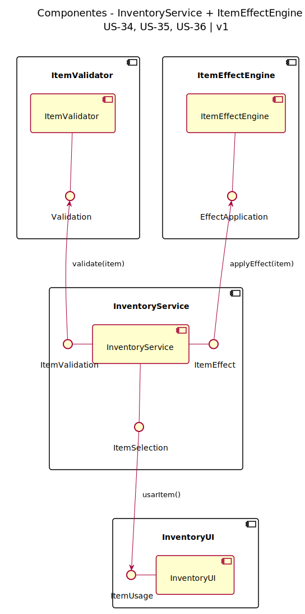
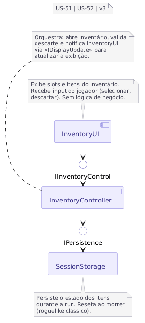

# 2.1. Módulo Notação UML – Modelagem Estática

Foco_1: Modelagem UML Estática.

Entrega Mínima: 1 Modelo Estático (ESCOPO: Diagrama de Classes; Diagrama de Componentes ou Diagrama de Implantação).

Apresentação (para a professora) explicando o modelo estático especificado, com: (i) rastro claro aos membros participantes (MOSTRAR QUADRO DE PARTICIPAÇÕES & COMMITS); (ii) justificativas & senso crítico sobre o modelo, e (iii) comentários gerais sobre o trabalho em equipe. Tempo da Apresentação: +/- 5min. Recomendação: Apresentar diretamente via Wiki ou GitPages do Projeto. Baixar os conteúdos com antecedência, evitando problemas de internet no momento de exposição nas Dinâmicas de Avaliação.

A Wiki ou GitPages do Projeto deve conter um tópico dedicado ao Módulo Modelagem Estática (Notação UML), com 1 modelo, histórico de versões, referências, e demais detalhamentos gerados pela equipe nesse escopo.

## Diagrama de Componentes — InventoryService + ItemEffectEngine

Sistema de componentes para gerenciar o uso de consumíveis (US-34, US-35, US-36).

### Descrição

O diagrama apresenta a arquitetura em componentes do sistema de consumíveis, organizado em 4 pacotes principais:

#### Componentes

- **InventoryUI**: Interface do usuário para seleção e uso de consumíveis
- **InventoryService**: Orquestrador central que coordena validação e aplicação de efeitos
- **ItemValidator**: Responsável pela validação de itens (disponibilidade, pré-condições)
- **ItemEffectEngine**: Engine que aplica os efeitos do consumível após validação

#### Interfaces (Provided)

- **ItemUsage**: Fornecida por InventoryUI para requisições de uso
- **ItemSelection**: Fornecida por InventoryService para receber seleção de itens
- **ItemValidation**: Fornecida por InventoryService para comunicação com validador
- **ItemEffect**: Fornecida por InventoryService para aplicação de efeitos
- **Validation**: Fornecida por ItemValidator para validação de itens
- **EffectApplication**: Fornecida por ItemEffectEngine para aplicação de efeitos

#### Fluxo de Dependências

1. **UI → InventoryService**: InventoryUI solicita uso via ItemUsage → ItemSelection
2. **InventoryService → Validator**: Valida item via ItemValidation → Validation
3. **InventoryService → Engine**: Aplica efeito via ItemEffect → EffectApplication

## Diagrama de Componentes — InventoryUI + Persistência de Inventário
 
Sistema de componentes para gerenciar o inventário e o descarte de itens (US-51, US-52).
 

 
### Descrição
 
O diagrama apresenta a arquitetura em componentes do sistema de inventário, organizado em 3 componentes principais e 2 interfaces explícitas:
 
#### Componentes
 
- **InventoryUI**: Interface do usuário para exibição de slots, itens e feedback visual. Não contém lógica de negócio
- **InventoryController**: Orquestrador central que coordena a abertura do inventário, valida o descarte e notifica a InventoryUI para atualização via <<IDisplayUpdate>>
- **SessionStorage**: Responsável por persistir o estado dos itens durante a run. Reseta ao morrer (comportamento roguelike clássico)

#### Interfaces (Provided)
 
- **IInventoryControl**: Fornecida por InventoryController para receber requisições de abertura e descarte originadas pela InventoryUI
- **IPersistence**: Fornecida por SessionStorage para salvar e carregar o estado do inventário durante a sessão
#### Fluxo de Dependências
 
1. **UI → InventoryController**: InventoryUI solicita operações via IInventoryControl (abrir inventário, descartar item)
2. **InventoryController → SessionStorage**: Persiste e recupera o estado do inventário via IPersistence
3. **InventoryController → UI**: Notifica a InventoryUI para atualizar a exibição via <<IDisplayUpdate>> (documentado via nota no componente)

## Histórico de Versionamento

| Nome                                            | Alteração                                        | Versão | Data       | Revisor                                     | Data da Revisão | Observações da Revisão                   |
| ----------------------------------------------- | ------------------------------------------------ | ------ | ---------- | ------------------------------------------- | --------------- | ---------------------------------------- |
| [Mateus Vieira](https://github.com/matix0/)     | Setup inicial do projeto                         | v0.1   | 13/04/2026 |
| [Philipe Morais](https://github.com/PhMoraiis/) | Adiciona Diagrama de Componentes para Consumiveis | v1.1   | 22/04/2026 | [Mateus Vieira](https://github.com/matix0/) | 22/04/2026      | Diagrama condiz com o esperado da tarefa |
| [Vinícius Rufino](https://github.com/RufinoVfR)      | Adiciona Diagrama de Componentes para Inventário  | v1.2   | 23/04/2026 |      