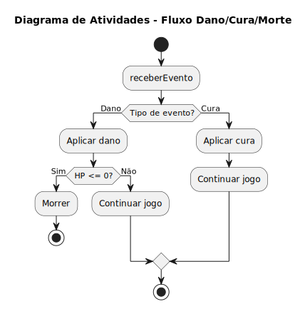
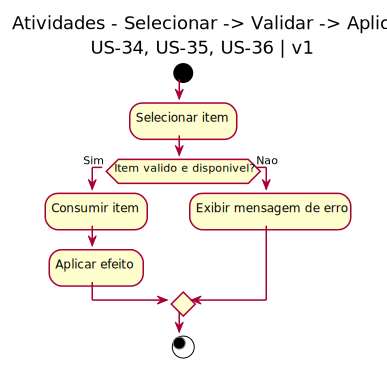

# 2.2.2. Diagramas de Atividades

Esta seção organiza os diagramas de atividades da modelagem dinâmica.

## O que é um Diagrama de Atividades?

O Diagrama de Atividades é um diagrama comportamental da UML que representa o fluxo de controle e/ou o fluxo de objetos em um processo, com ênfase na sequência das ações e nas condições que direcionam o fluxo.

As ações coordenadas por esse modelo podem ser iniciadas quando outras ações são concluídas, quando objetos ou dados se tornam disponíveis, ou ainda quando eventos externos ao fluxo ocorrem.

Por isso, esse diagrama é especialmente útil para modelar regras de decisão, paralelismo, sincronização e encadeamento de etapas em casos de uso e processos de negócio.

## Justificativa

Os Diagramas de Atividades foram escolhidos por permitirem detalhar o fluxo de controle, os processos internos e as regras de decisão dentro do sistema. Em mecânicas com múltiplas condições e caminhos alternativos (como sistemas de vida, cura, morte e o uso de diferentes itens consumíveis), este tipo de diagrama é essencial para mapear todas as possibilidades, validações e ações em paralelo, garantindo que a lógica e as regras de negócio sejam implementadas corretamente.

## Diagramas de Atividades Desenvolvidos

### Vida, Cura e Morte do Personagem

*Desenvolvido por: [Lucas Freire Lopes](https://github.com/AguionStryke)*

### Uso de Consumíveis

*Desenvolvido por: [Philipe Morais](https://github.com/PhMoraiis)*

1. **Selecionar item**: O jogador seleciona um consumível do inventário
2. **Validação**: O sistema verifica se o item é válido e está disponível
   - **Se SIM**: Procede com o consumo e aplicação do efeito
   - **Se NÃO**: Exibe mensagem de erro ao jogador
3. **Consumir item**: Remove o item do inventário
4. **Aplicar efeito**: Aplica o efeito do consumível no jogo

##### Pré-condições
- Bomba no inventário (US-34)
- Chave no inventário (US-35)
- Poção no inventário (US-36)

## Referências
- Materiais de apoio disponibilizados pela professora via Aprender3.
- https://www.uml-diagrams.org/activity-diagrams.html

## Histórico de Versionamento

| Nome                                                     | Alteração                                                             | Versão | Data       | Revisor                                     | Data de Revisão | Revisão                                                                                                             |
| -------------------------------------------------------- | --------------------------------------------------------------------- | ------ | ---------- | ------------------------------------------- | --------------- | ------------------------------------------------------------------------------------------------------------------- |
| [Mateus Vieira](https://github.com/matix0/)              | Setup inicial do projeto                                              | v0.1   | 13/04/2026 |                                             |                 |                                                                                                                     |
| [Philipe Morais](https://github.com/PhMoraiis/)          | Adiciona Diagrama de Atividades para Consumiveis                      | v1.1   | 22/04/2026 | [Mateus Vieira](https://github.com/matix0/) | 22/04/2026      | Fluxo do uso de itens muito bem explicado, diagrama simples e bem estruturado                                       |
| [Mateus Vieira](https://github.com/matix0/)              | Adição do Diagrama de Sequência Comportamento dos Inimigos em Combate | v1.2   | 22/04/2026 |                                             |                 |                                                                                                                     |
| [Pietro Calegari Visentin](https://github.com/pietrocv)  | Adição do Diagrama de Estados do Sistema de Equipamentos              | v1.3   | 22/04/2026 | [Mateus Vieira](https://github.com/matix0/) | 22/04/2026      | Senti que faltou um detalhamento maior do diagrama, como as funções funcionam, uma explicação via texto seria boa   |
| [Lucas Freire](https://github.com/AguionStryke)          | Adição do Diagrama de Atividades Vida, Cura e Morte do Personagem     | v1.4   | 23/04/2026 | [Mateus Vieira](https://github.com/matix0/) | 22/04/2026      | Fluxo do sistema de vida muito bem representado, considerando condição também qual a condição para morte do jogador |
| [Vinícius Rufino](https://github.com/RufinoVfR)          | Adiciona Diagrama de Sequência para Inventário                        | v1.5   | 23/04/2026 | [Mateus Vieira](https://github.com/matix0/) | 23/04/2026      | Representa muito bem como o sistema de uso do inventário funciona considerando atualização e descarte dos itens     |
| [Kauã Richard](https://github.com/kauarichard)           | Adiciona Diagrama de Sequência para Combate                           | v1.6   | 23/04/2026 | [Mateus Vieira](https://github.com/matix0/) | 22/04/2026      | Fluxo bem detalhado do sistema de combate, exemplifica bem como o jogador irá combater os inimigos                  |
| [Felipe Santos Veríssimo](https://github.com/verissimoo) | Adição do Diagrama de Estados Pausar/Retomar (US-49, US-50)           | v1.7   | 24/04/2026 | [Mateus Vieira](https://github.com/matix0/) | 24/04/2026      | Diagrama bem estruturado, com os estados de jogo bem definidos e transições claras.                                 |
| [Breno Lucena](https://github.com/BrenoLUCO)             | Adição do diagrama de sequencia iniciar partida                       | v1.8   | 23/04/2026 | [Mateus Vieira](https://github.com/matix0/) | 24/04/2026      | Processo de início de partida muito bem ilustrado, interações do menu ao GameSession cobrem bem o cenário.          |