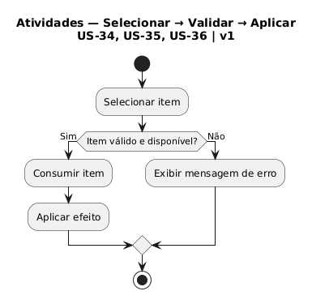

# 2.2. Módulo Notação UML – Modelagem Dinâmica

Foco_2: Modelagem UML Dinâmica.

Entrega Mínima: 1 Modelo Dinâmico (ESCOPO: Diagrama de Sequência; Diagrama de Atividades; Diagrama de Comunicação/Colaboração ou Diagrama de Estados).

Apresentação (para a professora) explicando o modelo dinâmico especificado, com: (i) rastro claro aos membros participantes (MOSTRAR QUADRO DE PARTICIPAÇÕES & COMMITS); (ii) justificativas & senso crítico sobre o modelo, e (iii) comentários gerais sobre o trabalho em equipe. Tempo da Apresentação: +/- 5min. Recomendação: Apresentar diretamente via Wiki ou GitPages do Projeto. Baixar os conteúdos com antecedência, evitando problemas de internet no momento de exposição nas Dinâmicas de Avaliação.

A Wiki ou GitPages do Projeto deve conter um tópico dedicado ao Módulo Modelagem Dinâmica (Notação UML), com 1 modelo, histórico de versões, referências, e demais detalhamentos gerados pela equipe nesse escopo.

## Diagrama de Atividades — Uso de Consumíveis

Fluxo de atividades para o processo de seleção, validação e aplicação de consumíveis (US-34, US-35, US-36).

### Descrição

Este diagrama apresenta o fluxo de atividades para o uso de consumíveis no sistema:

1. **Selecionar item**: O jogador seleciona um consumível do inventário
2. **Validação**: O sistema verifica se o item é válido e está disponível
   - **Se SIM**: Procede com o consumo e aplicação do efeito
   - **Se NÃO**: Exibe mensagem de erro ao jogador
3. **Consumir item**: Remove o item do inventário
4. **Aplicar efeito**: Aplica o efeito do consumível no jogo

### Pré-condições
- Bomba no inventário (US-34)
- Chave no inventário (US-35)
- Poção no inventário (US-36)

## Histórico de Versionamento

| Nome                                        | Alteração                | Versão | Data       |
| ------------------------------------------- | ------------------------ | ------ | ---------- |
| [Mateus Vieira](https://github.com/matix0/) | Setup inicial do projeto | v0.1   | 13/04/2026 |
| [Philipe Morais](https://github.com/PhMoraiis/) | Adiciona Diagrama de Atividades para Consumiveis | v1.1   | 22/04/2026 |
