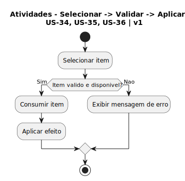

# 2.2. Módulo Notação UML – Modelagem Dinâmica

Foco_2: Modelagem UML Dinâmica.

Entrega Mínima: 1 Modelo Dinâmico (ESCOPO: Diagrama de Sequência; Diagrama de Atividades; Diagrama de Comunicação/Colaboração ou Diagrama de Estados).

Apresentação (para a professora) explicando o modelo dinâmico especificado, com: (i) rastro claro aos membros participantes (MOSTRAR QUADRO DE PARTICIPAÇÕES & COMMITS); (ii) justificativas & senso crítico sobre o modelo, e (iii) comentários gerais sobre o trabalho em equipe. Tempo da Apresentação: +/- 5min. Recomendação: Apresentar diretamente via Wiki ou GitPages do Projeto. Baixar os conteúdos com antecedência, evitando problemas de internet no momento de exposição nas Dinâmicas de Avaliação.

A Wiki ou GitPages do Projeto deve conter um tópico dedicado ao Módulo Modelagem Dinâmica (Notação UML), com 1 modelo, histórico de versões, referências, e demais detalhamentos gerados pela equipe nesse escopo.

## Diagrama de Atividades — Uso de Consumíveis

Fluxo de atividades para o processo de seleção, validação e aplicação de consumíveis (US-34, US-35, US-36).

### Descrição

Este diagrama apresenta o fluxo de atividades para o uso de consumíveis no sistema:

1. **Selecionar item**: O jogador seleciona um consumível do inventário
2. **Validação**: O sistema verifica se o item é válido e está disponível
   - **Se SIM**: Procede com o consumo e aplicação do efeito
   - **Se NÃO**: Exibe mensagem de erro ao jogador
3. **Consumir item**: Remove o item do inventário
4. **Aplicar efeito**: Aplica o efeito do consumível no jogo

### Pré-condições
- Bomba no inventário (US-34)
- Chave no inventário (US-35)
- Poção no inventário (US-36)

---

## Diagrama de Sequência — Ataque e Cálculo de Dano

Representação das interações temporais entre os objetos durante a execução de um ataque e disparo de projétil (US-21, US-22).

### Descrição

O diagrama de sequência ilustra o fluxo de mensagens entre as entidades desde o input do jogador até o feedback final do dano causado:

1. **Input de Ataque**: O Ator (Jogador) envia um comando para o objeto **Player**.
2. **Geração de Projétil**: O **Player** solicita à **Weapon** a criação de um novo projétil.
3. **Ciclo de Vida do Projétil**: 
   - O Projétil é instanciado.
   - Entra em um **loop** de movimentação e verificação de sobreposição (colisão).
4. **Aplicação de Dano**: Ao colidir com o **Enemy**, o Projétil aciona o método de sofrer dano.
5. **Feedback**: O Inimigo retorna a confirmação e o sistema envia um feedback visual/sonoro antes de destruir o projétil.

### Lifelines (Linhas de Vida)
- **Jogador**: Ator que inicia a dinâmica.
- **Player**: Controlador do personagem.
- **Weapon**: Responsável pela lógica de disparo.
- **Projectile**: Entidade dinâmica que processa a colisão.
- **Enemy**: Alvo que recebe a aplicação do dano.

## Histórico de Versionamento

| Nome                                            | Alteração                                        | Versão | Data       | Revisor                                     | Data da Revisão | Observações da Revisão                   |
| ----------------------------------------------- | ------------------------------------------------ | ------ | ---------- | ------------------------------------------- | --------------- | ---------------------------------------- |
| [Mateus Vieira](https://github.com/matix0/)     | Setup inicial do projeto                         | v0.1   | 13/04/2026 |                                             |                 |                                          |
| [Philipe Morais](https://github.com/PhMoraiis/) | Adiciona Diagrama de Atividades para Consumiveis | v1.1   | 22/04/2026 | [Mateus Vieira](https://github.com/matix0/) | 22/04/2026      | Diagrama condiz com o esperado da tarefa |
| [Kauã Richard](https://github.com/kauarichard)  | Adiciona Diagrama de Sequência para Combate      | v1.2   | 23/04/2026 |                                             |                 |                                          |