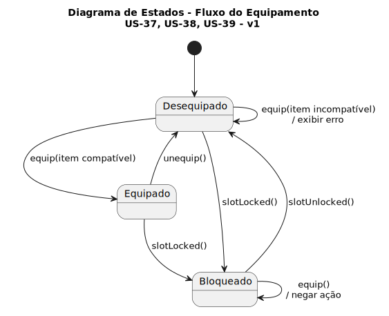
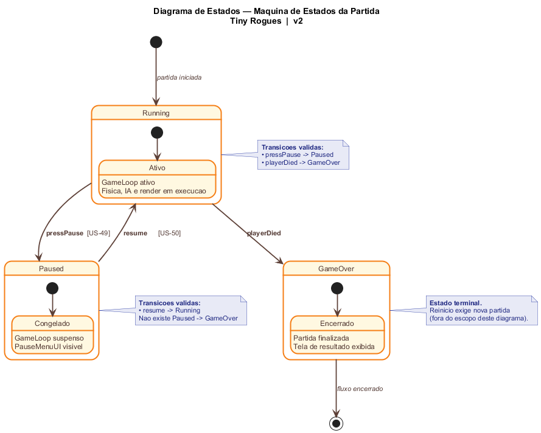

# 2.2. Módulo Notação UML – Modelagem Dinâmica

## O que é um Diagrama de Sequência?

O diagrama de sequência é o tipo mais comum de diagrama de interação na UML. Ele representa como diferentes participantes de um sistema trocam mensagens ao longo do tempo para realizar um comportamento específico.

Esse tipo de diagrama descreve a interação com foco na ordem cronológica das mensagens e em suas ocorrências sobre cada linha de vida (lifeline), permitindo visualizar com precisão quem chama quem, em que momento e sob quais condições.

### Diagramas de Sequência Desenvolvidos

| Diagrama                              | Descrição                                                           | Responsável | Status     |
| ------------------------------------- | ------------------------------------------------------------------- | ----------- | ---------- |
| Comportamento dos Inimigos em Combate | Representa o comportamento dos inimigos durante os combates no jogo | Mateus      | Em Revisão |

---

#### 2.2.1 — Ataque e Cálculo de Dano

Representação das interações temporais entre os objetos durante a execução de um ataque e disparo de projétil (US-21, US-22).

##### Descrição

O diagrama de sequência ilustra o fluxo de mensagens entre as entidades desde o input do jogador até o feedback final do dano causado:

1. **Input de Ataque**: O Ator (Jogador) envia um comando para o objeto **Player**.
2. **Geração de Projétil**: O **Player** solicita à **Weapon** a criação de um novo projétil.
3. **Ciclo de Vida do Projétil**: 
   - O Projétil é instanciado.
   - Entra em um **loop** de movimentação e verificação de sobreposição (colisão).
4. **Aplicação de Dano**: Ao colidir com o **Enemy**, o Projétil aciona o método de sofrer dano.
5. **Feedback**: O Inimigo retorna a confirmação e o sistema envia um feedback visual/sonoro antes de destruir o projétil.

##### Lifelines (Linhas de Vida)
- **Jogador**: Ator que inicia a dinâmica.
- **Player**: Controlador do personagem.
- **Weapon**: Responsável pela lógica de disparo.
- **Projectile**: Entidade dinâmica que processa a colisão.
- **Enemy**: Alvo que recebe a aplicação do dano.

#### 2.2.5 - Comportamento dos Inimigos

Arquivo fonte: [Sequencia_ComportamentoInimigo.puml](../Assets/UML/Sequencia_ComportamentoInimigo.puml)

##### Descrição Minuciosa do Processo

O fluxo modela o comportamento do inimigo durante a execução do jogo, com atualização contínua por frame e decisões táticas baseadas em distância, alcance e tipo de padrão de combate.

1. O ciclo começa no `GameLoop`, que envia `update(deltaTime)` para o `Enemy` a cada frame.
2. O `Enemy` delega a tomada de decisão ao `AIController`, mantendo separadas as responsabilidades de estado e comportamento.
3. O `AIController` executa `detectPlayer(Player)` para verificar se o alvo está dentro de `detectionRange`.
4. Se o jogador não for detectado, o controlador devolve para o inimigo a ação de manter estado passivo.
5. Se o jogador for detectado, o controlador calcula a distância atual e compara com `attackRange`.
6. Quando a distância é maior que o alcance de ataque, o inimigo entra em perseguição:
7. No tipo `MELEE`, o controlador chama `MeleePattern.chasePlayer(...)` e recebe um vetor de movimento para aproximação direta.
8. No tipo `RANGED`, o controlador chama `RangedPattern.chasePlayer(...)`, buscando posicionamento adequado para disparo.
9. No tipo `BOSS`, o controlador chama `BossPattern.chasePlayer(...)`, permitindo perseguição com comportamento mais estratégico.
10. Após o retorno do vetor de movimento, o `Enemy` atualiza sua posição usando velocidade e `deltaTime`.
11. Quando a distância é menor ou igual ao alcance de ataque, o inimigo entra em ofensiva.
12. No tipo `MELEE`, `attackPlayer(...)` tenta um golpe direto e, em caso de acerto, o `Player` recebe dano.
13. No tipo `RANGED`, `attackPlayer(...)` dispara projétil; o `Projectile` é instanciado e aplica dano ao colidir no `Player`.
14. No tipo `BOSS`, `attackPlayer(...)` pode executar golpe especial e, após o ataque, verifica condição de fase.
15. Se `Enemy.hp <= phaseTriggerHp`, o padrão do chefe executa `changePhase()`, alterando comportamento para os próximos ciclos.
16. Esse fluxo principal se repete continuamente dentro de um fragmento `loop`, refletindo a atualização frame a frame.
17. Em paralelo ao fluxo de IA, o diagrama também modela o subfluxo de dano recebido pelo inimigo.
18. Quando o `Player` ataca, o `Enemy` recebe `takeDamage(rawDamage)` e chama internamente `calculateResistance(rawDamage)`.
19. O dano efetivo é calculado considerando defesa/resistência, e o HP do inimigo é reduzido.
20. Se `hp > 0`, o inimigo permanece ativo e retorna ao ciclo comportamental normal no próximo frame.
21. Se `hp <= 0`, o inimigo executa `die()` e, na sequência, `dropReward()`.
22. Por fim, o `RewardSystem` é acionado para materializar a recompensa, encerrando o ciclo de vida daquela instância de inimigo.

## O que é um Diagrama de Atividades?

O Diagrama de Atividades é um diagrama comportamental da UML que representa o fluxo de controle e/ou o fluxo de objetos em um processo, com ênfase na sequência das ações e nas condições que direcionam o fluxo.

As ações coordenadas por esse modelo podem ser iniciadas quando outras ações são concluídas, quando objetos ou dados se tornam disponíveis, ou ainda quando eventos externos ao fluxo ocorrem.

Por isso, esse diagrama é especialmente útil para modelar regras de decisão, paralelismo, sincronização e encadeamento de etapas em casos de uso e processos de negócio.

### Diagramas de Atividades Desenvolvidos

| Diagrama                         | Descrição                                                                           | Responsável  | Status     |
| -------------------------------- | ----------------------------------------------------------------------------------- | ------------ | ---------- |
| Uso de Consumíveis               | Representa o fluxo de atividades para o uso de consumíveis                          | Philipe      | Finalizado |
| Vida, Cura e Morte do Personagem | Representa as possibilidades de ações e consequências em relação ao sistema de vida | Lucas Freire | Em Revisão |

#### 2.2.4 - Vida, Cura e Morte do Personagem

*Desenvolvido por: [Lucas Freire Lopes](https://github.com/AguionStryke)*

--- 

#### 2.2.6 — Uso de Consumíveis

Fluxo de atividades para o processo de seleção, validação e aplicação de consumíveis (US-34, US-35, US-36).

##### Descrição

Este diagrama apresenta o fluxo de atividades para o uso de consumíveis no sistema:

1. **Selecionar item**: O jogador seleciona um consumível do inventário
2. **Validação**: O sistema verifica se o item é válido e está disponível
   - **Se SIM**: Procede com o consumo e aplicação do efeito
   - **Se NÃO**: Exibe mensagem de erro ao jogador
3. **Consumir item**: Remove o item do inventário
4. **Aplicar efeito**: Aplica o efeito do consumível no jogo

##### Pré-condições
- Bomba no inventário (US-34)
- Chave no inventário (US-35)
- Poção no inventário (US-36)

## O que é um Diagrama de Estados?

Um Diagrama de Estados é uma representação comportamental da UML utilizada para mostrar os possíveis estados de um elemento do sistema e as transições que ocorrem entre esses estados ao longo de sua execução. Seu objetivo principal é representar, em alto nível, como o sistema reage a eventos e condições específicas.

Foi desenvolvido um Diagrama de Estados para representar o fluxo de estados de um item dentro do sistema de equipamentos do jogo. A modelagem considera situações como equipar, desequipar, bloqueio e desbloqueio de slot, além do tratamento de tentativas inválidas com itens incompatíveis.

### Diagramas de Estados Desenvolvidos

| Diagrama de Estados           | Descrição                                                                                         | Responsável | Status     |
| ----------------------------- | ------------------------------------------------------------------------------------------------- | ----------- | ---------- |
| Fluxo do Equipamento          | Representa os estados `Desequipado`, `Equipado` e `Bloqueado` no sistema de equipamentos          | Pietro      | Em Revisão |
| Máquina de Estados da Partida | Representa os estados `Running`, `Paused` e `GameOver` para pausar/retomar partida (US-49, US-50) | Felipe      | Feito      |

#### 2.2.7 - Fluxo do Equipamento

*Desenvolvido por: [Pietro Calegari Visentin](https://github.com/pietrocv)*

#### 2.2.8 — Abrir Inventário, Descartar Item e Atualizar UI
 
Fluxo de mensagens para o processo de abertura do inventário, descarte de item e atualização da interface (US-51, US-52).
 

 
##### Descrição
 
Este diagrama apresenta a sequência de mensagens trocadas entre os participantes durante o uso do inventário e o descarte de itens:
 
1. **Fase 1 — Abrir Inventário**: O jogador aciona a abertura do inventário. A InventoryUI solicita ao InventoryController o carregamento dos itens, que por sua vez consulta o InventoryService. A lista de itens retorna pela cadeia até ser exibida ao jogador

2. **Fase 2 — Descartar Item**: O jogador seleciona um item e solicita o descarte. O bloco `alt` modela dois fluxos alternativos:
   - **Confirma descarte**: O InventoryController remove o item via InventoryService e instrui a InventoryUI a atualizar a exibição com feedback visual
   - **Cancela descarte**: O InventoryController instrui a InventoryUI a exibir feedback de cancelamento

##### Participantes (Lifelines)
- **Jogador**: Ator externo que inicia as ações de abertura e descarte
- **InventoryUI**: Interface visual que responde a inputs e exibe o estado do inventário
- **InventoryController**: Lógica de controle que orquestra o fluxo completo
- **InventoryService**: Camada de acesso e persistência dos dados dos itens (SessionStorage)

##### Pré-condições
- Inventário com slots fixos disponíveis (US-51)
- Item previamente coletado presente no inventário (US-52)

---

#### 2.2.2 — Iniciar partida e navegar no menu principal

Diagrama de estados representando as transições entre os estados Running, Paused e GameOver (US-49, US-50).

Arquivo fonte: [UML_PausarRetomar_DiagramaCompleto.puml](../Assets/UML_PausarRetomar_DiagramaCompleto.puml)

##### Descrição

Este diagrama apresenta a máquina de estados da partida no contexto da funcionalidade de pausar e retomar:

##### Estados

- **Running (Ativo)**: GameLoop ativo — física, IA e render em execução
- **Paused (Congelado)**: GameLoop suspenso — PauseMenuUI visível
- **GameOver (Encerrado)**: Partida finalizada — tela de resultado exibida

##### Transições

1. **Running → Paused**: Jogador pressiona tecla Pause (`pressPause` [US-49])
2. **Paused → Running**: Jogador escolhe "Continuar" (`resume` [US-50])
3. **Running → GameOver**: Jogador morre (`playerDied`)
4. **GameOver → [*]**: Fluxo encerrado (reinício exige nova partida)

##### Regras

- Não existe transição Paused → GameOver
- GameOver é um estado terminal dentro deste escopo

*Desenvolvido por: [Felipe Santos Veríssimo](https://github.com/verissimoo)*

---

## Referências
- Materiais de apoio disponibilizados pela professora via Aprender3.
- https://www.uml-diagrams.org/sequence-diagrams.html
- https://www.uml-diagrams.org/activity-diagrams.html
- https://www.uml-diagrams.org/state-machine-diagrams-overview.html

## Histórico de Versionamento

| Nome                                                     | Alteração                                                             | Versão | Data       | Revisor                                     | Data de Revisão | Revisão                                                                                                             |
| -------------------------------------------------------- | --------------------------------------------------------------------- | ------ | ---------- | ------------------------------------------- | --------------- | ------------------------------------------------------------------------------------------------------------------- |
| [Mateus Vieira](https://github.com/matix0/)              | Setup inicial do projeto                                              | v0.1   | 13/04/2026 |                                             |                 |                                                                                                                     |
| [Philipe Morais](https://github.com/PhMoraiis/)          | Adiciona Diagrama de Atividades para Consumiveis                      | v1.1   | 22/04/2026 | [Mateus Vieira](https://github.com/matix0/) | 22/04/2026      | Fluxo do uso de itens muito bem explicado, diagrama simples e bem estruturado                                       |
| [Mateus Vieira](https://github.com/matix0/)              | Adição do Diagrama de Sequência Comportamento dos Inimigos em Combate | v1.2   | 22/04/2026 |                                             |                 |                                                                                                                     |
| [Pietro Calegari Visentin](https://github.com/pietrocv)  | Adição do Diagrama de Estados do Sistema de Equipamentos              | v1.3   | 22/04/2026 | [Mateus Vieira](https://github.com/matix0/) | 22/04/2026      | Senti que faltou um detalhamento maior do diagrama, como as funções funcionam, uma explicação via texto seria boa   |
| [Lucas Freire](https://github.com/AguionStryke)          | Adição do Diagrama de Atividades Vida, Cura e Morte do Personagem     | v1.4   | 23/04/2026 | [Mateus Vieira](https://github.com/matix0/) | 22/04/2026      | Fluxo do sistema de vida muito bem representado, considerando condição também qual a condição para morte do jogador |
| [Vinícius Rufino](https://github.com/RufinoVfR)          | Adiciona Diagrama de Sequência para Inventário                        | v1.5   | 23/04/2026 | [Mateus Vieira](https://github.com/matix0/) | 23/04/2026      | Representa muito bem como o sistema de uso do inventário funciona considerando atualização e descarte dos itens     |
| [Kauã Richard](https://github.com/kauarichard)           | Adiciona Diagrama de Sequência para Combate                           | v1.6   | 23/04/2026 | [Mateus Vieira](https://github.com/matix0/) | 22/04/2026      | Fluxo bem detalhado do sistema de combate, exemplifica bem como o jogador irá combater os inimigos                  |
| [Felipe Santos Veríssimo](https://github.com/verissimoo) | Adição do Diagrama de Estados Pausar/Retomar (US-49, US-50)           | v1.7   | 24/04/2026 |                                             |                 |                                                                                                                     |
| [Breno Lucena](https://github.com/BrenoLUCO)             | Adição do diagrama de sequencia iniciar partida                       | v1.8   | 23/04/2026 | [Mateus Vieira](https://github.com/matix0/) | data            | comentario                                                                                                          |