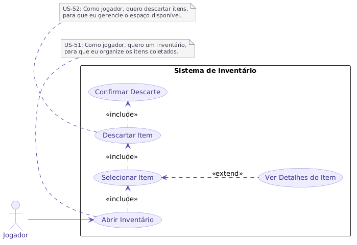

# 2.3. Módulo Notação UML – Modelagem Organizacional OU Casos de Uso

Foco_3: Modelagem Organizacional OU Casos de Uso.

Entrega Mínima: 1 Modelo, sendo esse o Diagrama de Pacotes ou o Diagrama de Casos de Uso.

Apresentação (para a professora) explicando o modelo especificado, com: (i) rastro claro aos membros participantes (MOSTRAR QUADRO DE PARTICIPAÇÕES & COMMITS); (ii) justificativas & senso crítico sobre o modelo, e (iii) comentários gerais sobre o trabalho em equipe. Tempo da Apresentação: +/- 5min. Recomendação: Apresentar diretamente via Wiki ou GitPages do Projeto. Baixar os conteúdos com antecedência, evitando problemas de internet no momento de exposição nas Dinâmicas de Avaliação.

A Wiki ou GitPages do Projeto deve conter um tópico dedicado ao Módulo Modelagem Organizacional/Casos de Uso (Notação UML), com 1 modelo, histórico de versões, referências, e demais detalhamentos gerados pela equipe nesse escopo.

## Diagrama de Casos de Uso — Uso de Consumíveis

Sistema de consumíveis do jogo com suporte a bomba, chave e poção (US-34, US-35, US-36).

### Descrição

Diagrama de casos de uso que apresenta os diferentes tipos de consumíveis que o jogador pode usar no sistema, com relações de inclusão para validação comum:

### Atores
- **Jogador**: Usuário do sistema que interage com os consumíveis (1..1 = exatamente um jogador por ação)

### Casos de Uso Primários

#### UC1 - Usar Bomba (US-34)
- **Ator**: Jogador
- **Pré-condição**: Bomba deve estar presente no inventário
- **Fluxo Principal**: O jogador seleciona e usa uma bomba, causando detonação em uma área
- **Incluir**: Validar item no inventário

#### UC2 - Usar Chave (US-35)
- **Ator**: Jogador
- **Pré-condição**: Chave deve estar presente no inventário
- **Fluxo Principal**: O jogador seleciona e usa uma chave para abrir portas ou baús bloqueados
- **Incluir**: Validar item no inventário

#### UC3 - Usar Poção (US-36)
- **Ator**: Jogador
- **Pré-condição**: Poção deve estar presente no inventário
- **Fluxo Principal**: O jogador seleciona e usa uma poção para restaurar vida ou ganhar buffs temporários
- **Incluir**: Validar item no inventário

### Casos de Uso Secundários (Include)

#### UC_Validar - Validar item no inventário
- **Tipo**: Caso de uso abstrato incluído pelos casos de uso primários
- **Responsabilidade**: Verificar se o item existe no inventário, se está disponível e se atende às pré-condições
- **Resultado**: Autoriza ou nega o uso do consumível

### Notação UML Utilizada
- **Ator** (stick figure): Representa o Jogador
- **Sistema** (rectangle): "Sistema de Consumíveis" delimita o escopo do sistema (subject)
- **Casos de Uso** (ovals): Representam as ações específicas
- **Associações** (setas simples): Indicam a ligação entre atores e casos de uso com multiplicidade (1..1)
- **Relacionamentos Include** (setas tracejadas com <<include>>): Indicam que um caso de uso sempre inclui o comportamento de outro

## Diagrama de Casos de Uso — Inventário e Descarte de Itens
 
Sistema de gerenciamento de inventário e descarte de itens (US-51, US-52).
 

 
### Descrição
 
Diagrama de casos de uso que apresenta o fluxo de gerenciamento do inventário e descarte de itens pelo jogador, com relações de inclusão e extensão:
 
### Atores
- **Jogador**: Usuário do sistema que interage com o inventário e realiza o descarte de itens (1..1 = exatamente um jogador por ação)

### Casos de Uso Primários
 
#### UC1 - Abrir Inventário (US-51)
- **Ator**: Jogador
- **Pré-condição**: Jogador deve estar em uma sessão de jogo ativa
- **Fluxo Principal**: O jogador abre o painel de inventário para visualizar os itens coletados
- **Incluir**: Selecionar Item

#### UC2 - Selecionar Item
- **Ator**: Jogador
- **Pré-condição**: Inventário deve estar aberto e conter ao menos um item
- **Fluxo Principal**: O jogador seleciona um item para interagir com ele
- **Incluir**: Descartar Item
- **Estender**: Ver Detalhes do Item

#### UC3 - Descartar Item (US-52)
- **Ator**: Jogador
- **Pré-condição**: Item deve estar selecionado no inventário
- **Fluxo Principal**: O jogador descarta o item selecionado, liberando o slot correspondente
- **Incluir**: Confirmar Descarte

### Casos de Uso Secundários (Include / Extend)
 
#### UC4 - Ver Detalhes do Item
- **Tipo**: Caso de uso opcional ativado via <<extend>>
- **Responsabilidade**: Exibir informações detalhadas do item selecionado (nome, descrição, atributos)
- **Resultado**: Jogador visualiza as informações antes de decidir o que fazer com o item

#### UC5 - Confirmar Descarte
- **Tipo**: Caso de uso abstrato incluído por Descartar Item
- **Responsabilidade**: Solicitar confirmação do jogador antes de efetuar o descarte permanente do item
- **Resultado**: Autoriza ou cancela o descarte do item

### Notação UML Utilizada
- **Ator** (stick figure): Representa o Jogador
- **Sistema** (rectangle): "Sistema de Inventário" delimita o escopo do sistema (subject)
- **Casos de Uso** (ovals): Representam as ações específicas disponíveis ao jogador
- **Associações** (setas simples): Indicam a ligação entre o ator e os casos de uso
- **Relacionamentos Include** (setas tracejadas com <<include>>): Indicam que um caso de uso sempre inclui o comportamento de outro
- **Relacionamentos Extend** (setas tracejadas com <<extend>>): Indicam comportamento opcional que pode ser adicionado ao caso de uso base

## Histórico de Versionamento

| Nome                                            | Alteração                                        | Versão | Data       | Revisor                                     | Data da Revisão | Observações da Revisão                   |
| ----------------------------------------------- | ------------------------------------------------ | ------ | ---------- | ------------------------------------------- | --------------- | ---------------------------------------- |
| [Mateus Vieira](https://github.com/matix0/)     | Setup inicial do projeto                         | v0.1   | 13/04/2026 |                                             |                 |                                          |
| [Philipe Morais](https://github.com/PhMoraiis/) | Adiciona Diagrama de Caso de Uso para Consumiveis | v1.1   | 22/04/2026 | [Mateus Vieira](https://github.com/matix0/) | 22/04/2026      | Diagrama condiz com o esperado da tarefa |
| [Vinícius Rufino](https://github.com/RufinoVfR)      | Adiciona Diagrama de Caso de Uso para Inventário  | v1.2   | 23/04/2026 | 
