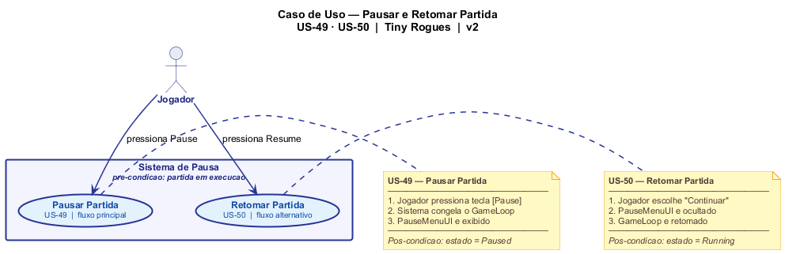
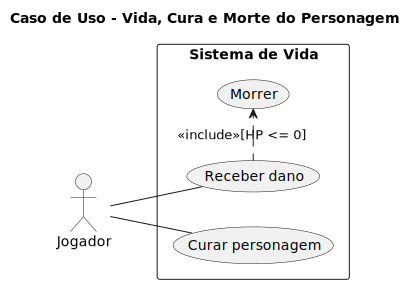

# 2.3. Diagramas de Casos de Uso

## O que é um Diagrama de Caso de Uso?

Um Diagrama de Casos de Uso é uma representação visual da UML utilizada na engenharia de software para mostrar como os atores externos interagem com o sistema. Seu objetivo principal é representar, em alto nível, os requisitos funcionais do sistema, destacando quais funcionalidades (casos de uso) geram resultados observáveis e de valor para usuários e demais partes interessadas.

## Justificativa

A elaboração dos Diagramas de Casos de Uso justifica-se por ser a técnica principal para modelar os requisitos funcionais sob a perspectiva dos usuários do sistema. Eles permitem identificar claramente quem são os atores (jogadores) e quais ações observáveis (como lutar, usar inventário ou pausar) o sistema deve prover. Essa modelagem facilita a comunicação do escopo entre os membros do time e garante que o desenvolvimento esteja alinhado com as necessidades propostas pelo Backlog.

### Tabela Resumo dos Diagramas Desenvolvidos

| Diagrama                                    | Tipo UML    | Descrição                                                                             | US Relacionadas                                                                                                                                                                                                                                                        | Responsável  | Status |
| ------------------------------------------- | ----------- | ------------------------------------------------------------------------------------- | ---------------------------------------------------------------------------------------------------------------------------------------------------------------------------------------------------------------------------------------------------------------------- | ------------ | ------ |
| Iniciar partida e navegar no menu principal | Caso de Uso | Representa as interações de abrir jogo, navegar no menu e iniciar partida             | [US-48](../Base/ArtefatosGeneralistas/1.2.8.Backlog.md?id=US-48)                                                                                                                                                                                                       | Breno        | Feito  |
| Pausar e Retomar Partida                    | Caso de Uso | Representa os casos de uso de pausar e retomar a partida (US-49, US-50)               | [US-49](../Base/ArtefatosGeneralistas/1.2.8.Backlog.md?id=US-49), [US-50](../Base/ArtefatosGeneralistas/1.2.8.Backlog.md?id=US-50)                                                                                                                                     | Felipe       | Feito  |
| Sistema de Combate                          | Caso de Uso | Representa o combate corpo a corpo e à distância (US-21, US-22)                       | [US-21](../Base/ArtefatosGeneralistas/1.2.8.Backlog.md?id=US-21), [US-22](../Base/ArtefatosGeneralistas/1.2.8.Backlog.md?id=US-22)                                                                                                                                     | Kauã         | Feito  |
| Vida, Cura e Morte do Personagem            | Caso de Uso | Representa a interação do jogador com o sistema de vida própria                       | [US-18](../Base/ArtefatosGeneralistas/1.2.8.Backlog.md?id=US-18), [US-19](../Base/ArtefatosGeneralistas/1.2.8.Backlog.md?id=US-19), [US-20](../Base/ArtefatosGeneralistas/1.2.8.Backlog.md?id=US-20)                                                                   | Lucas Freire | Feito  |
| Comportamento dos Inimigos em Combate       | Caso de Uso | Representa o comportamento dos inimigos durante os combates no jogo                   | [US-30](../Base/ArtefatosGeneralistas/1.2.8.Backlog.md?id=US-30), [US-31](../Base/ArtefatosGeneralistas/1.2.8.Backlog.md?id=US-31), [US-32](../Base/ArtefatosGeneralistas/1.2.8.Backlog.md?id=US-32), [US-33](../Base/ArtefatosGeneralistas/1.2.8.Backlog.md?id=US-33) | Mateus       | Feito  |
| Uso de Consumíveis                          | Caso de Uso | Representa o uso de bomba, chave e poção (US-34, US-35, US-36)                        | [US-34](../Base/ArtefatosGeneralistas/1.2.8.Backlog.md?id=US-34), [US-35](../Base/ArtefatosGeneralistas/1.2.8.Backlog.md?id=US-35), [US-36](../Base/ArtefatosGeneralistas/1.2.8.Backlog.md?id=US-36)                                                                   | Philipe      | Feito  |
| Equipar Itens                               | Caso de Uso | Representa a interação do jogador com o sistema ao equipar arma, armadura e acessório | [US-37](../Base/ArtefatosGeneralistas/1.2.8.Backlog.md?id=US-37), [US-38](../Base/ArtefatosGeneralistas/1.2.8.Backlog.md?id=US-38), [US-39](../Base/ArtefatosGeneralistas/1.2.8.Backlog.md?id=US-39)                                                                   | Pietro       | Feito  |
| Inventário e Descarte de Itens              | Caso de Uso | Representa o gerenciamento de inventário e descarte de itens (US-51, US-52)           | [US-51](../Base/ArtefatosGeneralistas/1.2.8.Backlog.md?id=US-51), [US-52](../Base/ArtefatosGeneralistas/1.2.8.Backlog.md?id=US-52)                                                                                                                                     | Vinícius     | Feito  |

## Diagramas Desenvolvidos

### Iniciar partida e navegar no menu principal

*Desenvolvido por: [Breno Lucena](https://github.com/BrenoLUCO)*

#### Descrição do Modelo

O diagrama de casos de uso acima representa as principais interações do **Jogador** com o sistema de jogo. Os três casos de uso essenciais identificados são:

**UC1 - Abrir jogo:** Permite ao jogador abrir o jogo e acessar o menu principal.
 - Objetivo: iniciar a aplicação.
 - Pré-condição: jogo instalado e executável disponível.
 - Pós-condição: menu principal exibido.

**UC2 - Navegar menu:** Oferece interface para navegação entre as opções do menu principal
- Objetivo: permitir acesso às funcionalidades principais.
- Pré-condição: aplicação aberta.
- Pós-condição: opção do menu selecionada.

**UC3 - Iniciar partida:** Permite ao jogador começar uma nova partida do jogo

- Objetivo: começar uma sessão de jogo.
- Pré-condição: menu principal ativo.
- Pós-condição: partida em execução.

### Pausar e Retomar Partida

Sistema de pausa e retomada da partida (US-49, US-50).

Arquivo fonte: [UML_PausarRetomar_DiagramaCompleto.puml](../Assets/UML_PausarRetomar_DiagramaCompleto.puml)

*Desenvolvido por: [Felipe Santos Veríssimo](https://github.com/verissimoo)*

#### Descrição

Diagrama de casos de uso que apresenta as funcionalidades de pausar e retomar a partida, com notas detalhando o fluxo de cada cenário:

#### Atores
- **Jogador**: Usuário do sistema que interage com a funcionalidade de pausa (1..1 = exatamente um jogador por ação)

#### Casos de Uso

**UC1 - Pausar Partida (US-49)**
- **Ator**: Jogador
- **Pré-condição**: Partida em execução
- **Fluxo Principal**:
  1. Jogador pressiona tecla [Pause]
  2. Sistema congela o GameLoop
  3. PauseMenuUI é exibido
- **Pós-condição**: estado = Paused

**UC2 - Retomar Partida (US-50)**
- **Ator**: Jogador
- **Pré-condição**: Partida pausada
- **Fluxo Principal**:
  1. Jogador escolhe "Continuar"
  2. PauseMenuUI é ocultado
  3. GameLoop é retomado
- **Pós-condição**: estado = Running

#### Notação UML Utilizada
- **Ator** (stick figure): Representa o Jogador
- **Sistema** (rectangle): "Sistema de Pausa" delimita o escopo do sistema
- **Casos de Uso** (ovals): Representam as ações de Pausar e Retomar
- **Associações** (setas): Indicam a ligação entre o ator e os casos de uso

### Sistema de Combate

Sistema de combate do jogador focado em mecânicas de ataque corpo a corpo e à distância (US-21, US-22).

*Desenvolvido por: [Kauã Richard](https://github.com/kauarichard)*

#### Descrição

O diagrama detalha as intenções de ataque do jogador e como a mecânica de ataque a distância se comporta como uma extensão funcional da ação de atacar um inimigo por meio da utilização de projéteis.

#### Atores
- **Jogador**: Usuário do sistema que controla o personagem e aciona os comandos de combate (1..1).

#### Casos de Uso Primários

**UC01 - Equipar Arma**
- **Gatilho**: O jogador seleciona um item ofensivo.
- **Função**: Garante que os atributos de ataque estejam disponíveis. É uma **inclusão obrigatória** para a realização de ataques.

**UC4 - Atacar Inimigo (US-21)**
- **Ator**: Jogador.
- **Inclui**: **UC01 (Equipar Arma)** e **UC_CausaDano**.
- **Fluxo Principal**: O sistema verifica o equipamento e inicia a animação de ataque. Se houver colisão, o fluxo de causar dano é invocado.

**UC5 - Atacar a Distância (US-22)**
- **Ator**: Jogador.
- **Inclui**: **UC01 (Equipar Arma)** e **UC_CausaDano**.
- **Fluxo Principal**: O sistema valida a arma de longo alcance e dispara um projétil. O sucesso depende da colisão do projétil com o alvo.

**UC_CausaDano**
- **Função**: Processa a regra de negócio de redução de HP.
- **Resultado Esperado**: Subtração de vida do inimigo e verificação do estado de morte.

#### Notação UML Utilizada
- **Ator**: Representa o Jogador.
- **Sistema (Retângulo)**: Delimita o escopo das regras de combate.
- **Relacionamento Include (<<include>>)**: Indica que um caso de uso é parte essencial do outro. No modelo, atacar inclui sempre "Estar equipado" e "Causar dano".

### Vida, Cura e Morte do Personagem

*Desenvolvido por: [Lucas Freire Lopes](https://github.com/AguionStryke)*

### Comportamento dos Inimigos em Combate

*Desenvolvido por: [Mateus Vinicius Vieira](https://github.com/matix0)*

#### Descrição

Diagrama de casos de uso que modela o comportamento de inteligência artificial (IA) dos inimigos durante o combate, detalhando o processo de engajamento contra o jogador por meio de perseguição e ataques, incluindo suas respectivas especializações.

#### Atores
- **Inimigo**: Entidade não jogável controlada pelo sistema que detecta e entra em conflito com o alvo (jogador).

#### Casos de Uso Primários

**UC1 - Engajar Jogador em Combate**
- **Ator**: Inimigo
- **Pré-condição**: Jogador entra na área de detecção/aggro do inimigo.
- **Fluxo Principal**: O inimigo assume comportamento hostil e inicia o ciclo tático de combate.
- **Incluir**: Perseguir Alvo, Atacar Alvo.

#### Casos de Uso Secundários (Include / Especialização)

**UC2 - Perseguir Alvo**
- **Tipo**: Incluído obrigatoriamente por Engajar Jogador em Combate (`<<include>>`).
- **Responsabilidade**: Gerenciar a aproximação e posicionamento do inimigo.
- **Especializações** (Herança): 
  - **Perseguição Direta**: Avanço em linha reta.
  - **Perseguição em Padrão**: Movimentação mais complexa, prevendo ou desviando de obstáculos.

**UC3 - Atacar Alvo**
- **Tipo**: Incluído obrigatoriamente por Engajar Jogador em Combate (`<<include>>`).
- **Responsabilidade**: Executar a ação ofensiva.
- **Especializações** (Herança):
  - **Ataque Corpo a Corpo**: Ofensiva de curto alcance (Melee).
  - **Ataque à Distância**: Ofensiva baseada em disparos e projéteis (Ranged).

#### Notação UML Utilizada
- **Ator** (stick figure): Representa o Inimigo disparando as ações autônomas.
- **Sistema** (rectangle): "Sistema de Inimigo" delimitando o motor de IA.
- **Casos de Uso** (ovals): Representam as rotinas executáveis de comportamento.
- **Relacionamentos Include** (setas tracejadas com `<<include>>`): Mostram que para estar "Engajado", o inimigo obrigatoriamente utiliza rotinas de perseguição e ataque.
- **Generalização** (setas contínuas com ponta triangular oca): Representam herança, onde casos de uso filhos herdam os comportamentos do caso de uso pai (ex: Ataque Corpo a Corpo é uma forma específica de Atacar Alvo).

### Uso de Consumíveis

Sistema de consumíveis do jogo com suporte a bomba, chave e poção (US-34, US-35, US-36).

*Desenvolvido por: [Philipe Morais](https://github.com/PhMoraiis)*

#### Descrição

Diagrama de casos de uso que apresenta os diferentes tipos de consumíveis que o jogador pode usar no sistema, com relações de inclusão para validação comum:

#### Atores
- **Jogador**: Usuário do sistema que interage com os consumíveis (1..1 = exatamente um jogador por ação)

#### Casos de Uso Primários

**UC1 - Usar Bomba (US-34)**
- **Ator**: Jogador
- **Pré-condição**: Bomba deve estar presente no inventário
- **Fluxo Principal**: O jogador seleciona e usa uma bomba, causando detonação em uma área
- **Incluir**: Validar item no inventário

**UC2 - Usar Chave (US-35)**
- **Ator**: Jogador
- **Pré-condição**: Chave deve estar presente no inventário
- **Fluxo Principal**: O jogador seleciona e usa uma chave para abrir portas ou baús bloqueados
- **Incluir**: Validar item no inventário

**UC3 - Usar Poção (US-36)**
- **Ator**: Jogador
- **Pré-condição**: Poção deve estar presente no inventário
- **Fluxo Principal**: O jogador seleciona e usa uma poção para restaurar vida ou ganhar buffs temporários
- **Incluir**: Validar item no inventário

#### Casos de Uso Secundários (Include)

**UC_Validar - Validar item no inventário**
- **Tipo**: Caso de uso abstrato incluído pelos casos de uso primários
- **Responsabilidade**: Verificar se o item existe no inventário, se está disponível e se atende às pré-condições
- **Resultado**: Autoriza ou nega o uso do consumível

#### Notação UML Utilizada
- **Ator** (stick figure): Representa o Jogador
- **Sistema** (rectangle): "Sistema de Consumíveis" delimita o escopo do sistema (subject)
- **Casos de Uso** (ovals): Representam as ações específicas
- **Associações** (setas simples): Indicam a ligação entre atores e casos de uso com multiplicidade (1..1)
- **Relacionamentos Include** (setas tracejadas com <<include>>): Indicam que um caso de uso sempre inclui o comportamento de outro

### Equipar Itens

.svg)

*Desenvolvido por: [Pietro Calegari Visentin](https://github.com/pietrocv)*

### Inventário e Descarte de Itens
 
Sistema de gerenciamento de inventário e descarte de itens (US-51, US-52).
 

 
*Desenvolvido por: [Vinícius Rufino](https://github.com/RufinoVfR)*

#### Descrição
 
Diagrama de casos de uso que apresenta o fluxo de gerenciamento do inventário e descarte de itens pelo jogador, com relações de inclusão e extensão:
 
#### Atores
- **Jogador**: Usuário do sistema que interage com o inventário e realiza o descarte de itens (1..1 = exatamente um jogador por ação)

#### Casos de Uso Primários
 
**UC1 - Abrir Inventário (US-51)**
- **Ator**: Jogador
- **Pré-condição**: Jogador deve estar em uma sessão de jogo ativa
- **Fluxo Principal**: O jogador abre o painel de inventário para visualizar os itens coletados
- **Incluir**: Selecionar Item

**UC2 - Selecionar Item**
- **Ator**: Jogador
- **Pré-condição**: Inventário deve estar aberto e conter ao menos um item
- **Fluxo Principal**: O jogador seleciona um item para interagir com ele
- **Incluir**: Descartar Item
- **Estender**: Ver Detalhes do Item

**UC3 - Descartar Item (US-52)**
- **Ator**: Jogador
- **Pré-condição**: Item deve estar selecionado no inventário
- **Fluxo Principal**: O jogador descarta o item selecionado, liberando o slot correspondente
- **Incluir**: Confirmar Descarte

#### Casos de Uso Secundários (Include / Extend)
 
**UC4 - Ver Detalhes do Item**
- **Tipo**: Caso de uso opcional ativado via <<extend>>
- **Responsabilidade**: Exibir informações detalhadas do item selecionado (nome, descrição, atributos)
- **Resultado**: Jogador visualiza as informações antes de decidir o que fazer com o item

**UC5 - Confirmar Descarte**
- **Tipo**: Caso de uso abstrato incluído por Descartar Item
- **Responsabilidade**: Solicitar confirmação do jogador antes de efetuar o descarte permanente do item
- **Resultado**: Autoriza ou cancela o descarte do item

#### Notação UML Utilizada
- **Ator** (stick figure): Representa o Jogador
- **Sistema** (rectangle): "Sistema de Inventário" delimita o escopo do sistema (subject)
- **Casos de Uso** (ovals): Representam as ações específicas disponíveis ao jogador
- **Associações** (setas simples): Indicam a ligação entre o ator e os casos de uso
- **Relacionamentos Include** (setas tracejadas com <<include>>): Indicam que um caso de uso sempre inclui o comportamento de outro
- **Relacionamentos Extend** (setas tracejadas com <<extend>>): Indicam comportamento opcional que pode ser adicionado ao caso de uso base

## Referências
- Materiais de apoio disponibilizados pela professora via Aprender3.
- https://www.uml-diagrams.org/use-case-diagrams.html
- https://www.uml-diagrams.org/use-case.html
- https://www.uml-diagrams.org/use-case-actor-association
- https://www.uml-diagrams.org/use-case-reference.html

## Histórico de Versionamento

| Nome                                                     | Alteração                                                           | Versão | Data       | Revisor                                         | Data de Revisão | Revisão                                                                                                                          |
| -------------------------------------------------------- | ------------------------------------------------------------------- | ------ | ---------- | ----------------------------------------------- | --------------- | -------------------------------------------------------------------------------------------------------------------------------- |
| [Mateus Vieira](https://github.com/matix0/)              | Setup inicial do projeto                                            | v0.1   | 13/04/2026 |                                                 |                 |                                                                                                                                  |
| [Philipe Morais](https://github.com/PhMoraiis/)          | Adiciona Diagrama de Caso de Uso para Consumiveis                   | v1.1   | 22/04/2026 | [Mateus Vieira](https://github.com/matix0/)     | 22/04/2026      | Processo de uso dos itens bem detalhado, gostei também do detalhamento do processo                                               |
| [Mateus Vieira](https://github.com/matix0/)              | Adição do UML de comportamento dos inimigos                         | v1.2   | 22/04/2026 | [Philipe Morais](https://github.com/PhMoraiis/) | 23/04/2026      |                                                                                                                                  |
| [Pietro Calegari Visentin](https://github.com/pietrocv)  | Adição do Diagrama de Caso de Uso Equipar Itens                     | v1.3   | 22/04/2026 | [Mateus Vieira](https://github.com/matix0/)     | 22/04/2026      | Diagrama passou pelo processo de revisão visual e após as mudanças ficou muito bom, fácil legibilidade e descreve bem o processo |
| [Lucas Freire](https://github.com/AguionStryke)          | Adição do Diagrama de Casos de Uso Vida, Cura e Morte do Personagem | v1.4   | 23/04/2026 | [Mateus Vieira](https://github.com/matix0/)     | 23/04/2026      | Diagrama exemplifica o sistema de vida como deveria ser                                                                          |
| [Vinícius Rufino](https://github.com/RufinoVfR)          | Adiciona Diagrama de Caso de Uso para Inventário                    | v1.5   | 23/04/2026 | [Mateus Vieira](https://github.com/matix0/)     | 23/04/2026      | Descreve bem o gerenciamento de inventário, gostei da presença da parte de detalhamento do item                                  |
| [Kauã Richard](https://github.com/kauarichard)           | Adiciona Diagrama de Casos de Uso para Combate                      | v1.6   | 23/04/2026 | [Mateus Vieira](https://github.com/matix0/)     | 22/04/2026      | Poderia ter mais detalhes sobre o fluxo de combate, como por exemplo precisar de umar arma e causar dano                         |
| [Felipe Santos Veríssimo](https://github.com/verissimoo) | Adição do Diagrama de Caso de Uso Pausar/Retomar (US-49, US-50)     | v1.7   | 24/04/2026 | [Mateus Vieira](https://github.com/matix0/)     | 24/04/2026      | Caso de uso mapeia bem as interações do jogador e a interface de pausa.                                          |
| [Breno Lucena](https://github.com/BrenoLUCO)             | Adição do diagrama de casos de uso                                  | v1.8   | 23/04/2026 | [Mateus Vieira](https://github.com/matix0/)     | 24/04/2026      | Muito claro como as interações de menu levam ao início da partida, as pré-condições estão adequadas.             |