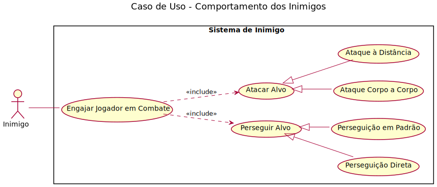
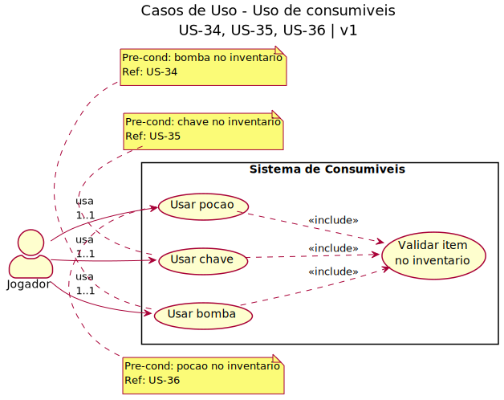

# 2.3. Módulo Notação UML – Modelagem Organizacional OU Casos de Uso

## O que é um Diagrama de Caso de Uso?

Um Diagrama de Casos de Uso é uma representação visual da UML utilizada na engenharia de software para mostrar como os atores externos interagem com o sistema. Seu objetivo principal é representar, em alto nível, os requisitos funcionais do sistema, destacando quais funcionalidades (casos de uso) geram resultados observáveis e de valor para usuários e demais partes interessadas.

### Diagramas de Caso de Uso Desenvolvidos

| Diagrama                              | Descrição                                                                             | Responsável | Status |
| ------------------------------------- | ------------------------------------------------------------------------------------- | ----------- | ------ |
| Comportamento dos Inimigos em Combate | Representa o comportamento dos inimigos durante os combates no jogo                   | Mateus      | Feito  |
| Equipar Itens                         | Representa a interação do jogador com o sistema ao equipar arma, armadura e acessório | Pietro      | Feito  |

#### 2.3.1 — Sistema de Combate

Sistema de combate do jogador focado em mecânicas de ataque corpo a corpo e à distância (US-21, US-22).

##### Descrição

O diagrama detalha as intenções de ataque do jogador e como a mecânica de projéteis se comporta como uma extensão funcional da ação de atacar um inimigo.

##### Atores
- **Jogador**: Usuário do sistema que controla o personagem e aciona os comandos de combate (1..1).

##### Casos de Uso Primários

##### UC4 - Atacar Inimigo (US-21)
- **Ator**: Jogador
- **Gatilho**: Input de ataque físico ou comando de ação ofensiva.
- **Fluxo Principal**: O sistema identifica o alvo, calcula o dano base da arma equipada e aplica a redução na vida do inimigo.
- **Resultado Esperado**: Dano aplicado com sucesso e feedback visual/sonoro.

##### UC5 - Atacar a Distância (US-22)
- **Ator**: Jogador
- **Extender**: UC4 - Atacar Inimigo
- **Fluxo Principal**: Quando o jogador utiliza armas de longo alcance, a funcionalidade de ataque é estendida para incluir a geração de um projétil e o cálculo de trajetória.
- **Condição de Extensão**: O jogador deve possuir uma arma de projétil equipada e munição disponível (se aplicável).

##### Notação UML Utilizada
- **Ator** (stick figure): Representa o Jogador.
- **Sistema** (rectangle): "Sistema de Combate" delimita o escopo das regras de dano e física.
- **Casos de Uso** (ovals): Representam as ações de ataque.
- **Relacionamento Extend** (setas tracejadas com <<extend>>): Indica que "Atacar a Distância" é uma variação opcional e especializada do caso de uso base "Atacar Inimigo".

---

#### 2.3.5 - Comportamento dos Inimigos em Combate

*Desenvolvido por: [Mateus Vinicius Vieira](https://github.com/matix0)*

---

#### 2.3.6 — Uso de Consumíveis

Sistema de consumíveis do jogo com suporte a bomba, chave e poção (US-34, US-35, US-36).

##### Descrição

Diagrama de casos de uso que apresenta os diferentes tipos de consumíveis que o jogador pode usar no sistema, com relações de inclusão para validação comum:

##### Atores
- **Jogador**: Usuário do sistema que interage com os consumíveis (1..1 = exatamente um jogador por ação)

##### Casos de Uso Primários

###### UC1 - Usar Bomba (US-34)
- **Ator**: Jogador
- **Pré-condição**: Bomba deve estar presente no inventário
- **Fluxo Principal**: O jogador seleciona e usa uma bomba, causando detonação em uma área
- **Incluir**: Validar item no inventário

###### UC2 - Usar Chave (US-35)
- **Ator**: Jogador
- **Pré-condição**: Chave deve estar presente no inventário
- **Fluxo Principal**: O jogador seleciona e usa uma chave para abrir portas ou baús bloqueados
- **Incluir**: Validar item no inventário

###### UC3 - Usar Poção (US-36)
- **Ator**: Jogador
- **Pré-condição**: Poção deve estar presente no inventário
- **Fluxo Principal**: O jogador seleciona e usa uma poção para restaurar vida ou ganhar buffs temporários
- **Incluir**: Validar item no inventário

##### Casos de Uso Secundários (Include)

###### UC_Validar - Validar item no inventário
- **Tipo**: Caso de uso abstrato incluído pelos casos de uso primários
- **Responsabilidade**: Verificar se o item existe no inventário, se está disponível e se atende às pré-condições
- **Resultado**: Autoriza ou nega o uso do consumível

##### Notação UML Utilizada
- **Ator** (stick figure): Representa o Jogador
- **Sistema** (rectangle): "Sistema de Consumíveis" delimita o escopo do sistema (subject)
- **Casos de Uso** (ovals): Representam as ações específicas
- **Associações** (setas simples): Indicam a ligação entre atores e casos de uso com multiplicidade (1..1)
- **Relacionamentos Include** (setas tracejadas com <<include>>): Indicam que um caso de uso sempre inclui o comportamento de outro

---

  

#### 2.3.7 - Equipar Itens

.svg)

*Desenvolvido por: [Pietro Calegari Visentin](https://github.com/pietrocv)*

---

## Referências
- Materiais de apoio disponibilizados pela professora via Aprender3.
- https://www.uml-diagrams.org/use-case-diagrams.html

## Histórico de Versionamento

| Nome                                                    | Alteração                                         | Versão | Data       | Revisor                                         | Data de Revisão | Revisão                                                                                                  |
| ------------------------------------------------------- | ------------------------------------------------- | ------ | ---------- | ----------------------------------------------- | --------------- | -------------------------------------------------------------------------------------------------------- |
| [Mateus Vieira](https://github.com/matix0/)             | Setup inicial do projeto                          | v0.1   | 13/04/2026 |                                                 |                 |                                                                                                          |
| [Philipe Morais](https://github.com/PhMoraiis/)         | Adiciona Diagrama de Caso de Uso para Consumiveis | v1.1   | 22/04/2026 | [Mateus Vieira](https://github.com/matix0/)     | 22/04/2026      | Processo de uso dos itens bem detalhado, gostei também do detalhamento do processo                       |
| [Mateus Vieira](https://github.com/matix0/)             | Adição do UML de comportamento dos inimigos       | v1.2   | 22/04/2026 | [Philipe Morais](https://github.com/PhMoraiis/) | 22/04/2026      |                                                                                                          |
| [Pietro Calegari Visentin](https://github.com/pietrocv) | Adição do Diagrama de Caso de Uso Equipar Itens   | v1.3   | 22/04/2026 | [Mateus Vieira](https://github.com/matix0/)     | 22/04/2026      | Diagrama condiz com o esperado da tarefa                                                                 |
| [Kauã Richard](https://github.com/kauarichard)          | Adiciona Diagrama de Casos de Uso para Combate    | v1.4   | 23/04/2026 | [Mateus Vieira](https://github.com/matix0/)     | 22/04/2026      | Poderia ter mais detalhes sobre o fluxo de combate, como por exemplo precisar de umar arma e causar dano |