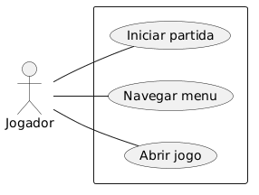

# 2.3. Módulo Notação UML – Modelagem Organizacional OU Casos de Uso

## Como este diagrama atende ao módulo

Este artefato modela as interações essenciais entre o ator Jogador e o Sistema de Jogo, cobrindo o foco de Casos de Uso solicitado no módulo. O diagrama apresenta um ator externo, três casos de uso centrais e associações diretas, permitindo rastrear requisitos funcionais iniciais da aplicação. 

## Diagrama de Casos de Uso

  

## Descrição do Modelo

O diagrama de casos de uso acima representa as principais interações do **Jogador** com o sistema de jogo. Os três casos de uso essenciais identificados são:

**UC1 - Abrir jogo:** Permite ao jogador      
 - Objetivo: iniciar a aplicação.
 - Pré-condição: jogo instalado e executável disponível.
 - Pós-condição: menu principal exibido.

**UC2 - Navegar menu:** Oferece interface para navegação entre as opções do menu principal
- Objetivo: permitir acesso às funcionalidades principais.
- Pré-condição: aplicação aberta.
- Pós-condição: opção do menu selecionada.

**UC3 - Iniciar partida:** Permite ao jogador começar uma nova partida do jogo

- Objetivo: começar uma sessão de jogo.
- Pré-condição: menu principal ativo.
- Pós-condição: partida em execução.

## Justificativas e Análise Crítica

No modelo, foram identificados os casos de uso mais críticos do ponto de vista do jogador. A modelagem prioriza clareza e visão de alto nível para facilitar comunicação com a equipe. Como evolução, o grupo pode incluir relacionamentos include/extend e casos complementares como Configurar opções e Carregar partida.

## Participações e Rastreabilidade

| Integrante | Participação no artefato | Commit/Link | Data |
| ---------- | ------------------------- | ----------- | ---- |
| Breno Lucena | Modelagem do diagrama e documentação textual | [Issue](https://github.com/UnBArqDsw2026-1-Turma02/2026.1_T02_G1_MadDev_Entrega_02/issues/1) | 22/04/2026 |

## Histórico de Versionamento

| Nome                                        | Alteração                | Versão | Data       |
| ------------------------------------------- | ------------------------ | ------ | ---------- |
| [Mateus Vieira](https://github.com/matix0/) | Setup inicial do projeto | v0.1   | 13/04/2026 |
| [Breno Lucena](https://github.com/BrenoLUCO/)| Adição do diagrama de casos de uso | v0.2   | 22/04/2026 |

## Referências

- Notação UML 2.5
- Requisitos do Projeto MadDev
- https://www.uml-diagrams.org/use-case-diagrams.html
- https://www.uml-diagrams.org/use-case.html
- https://www.uml-diagrams.org/use-case-actor-association.html
- https://www.uml-diagrams.org/use-case-reference.html